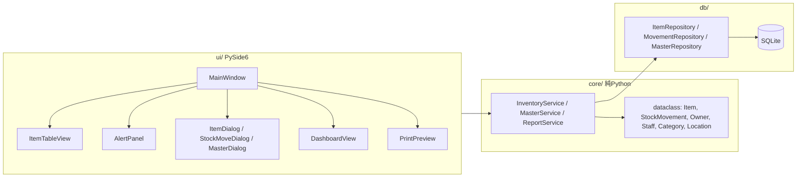

# 備品在庫管理アプリ 企画書

- 作成日: 2026-10-01
- ステータス: ドラフト(要件定義済み・設計レビュー待ち)

---

## 1. 背景と目的

設備管理現場における備品(消耗品・工具等)の在庫を、Excel や紙台帳に代わってローカル PC 上で一元管理する。
在庫が閾値を下回った際に気づける仕組みと、発注先(販売ページ)へ即座にアクセスできる導線を提供し、欠品による作業停止と発注漏れを防ぐ。

## 2. 前提・制約

| 項目 | 内容 |
| --- | --- |
| 利用形態 | ローカルスタンドアロン。単一 PC・単一ユーザーで運用 |
| 同時編集 | 想定しない(複数デバイスからの同時アクセス不要) |
| 技術スタック | Python 3.x / SQLite / PySide6 |
| ネットワーク | オフラインで全機能が動作すること(販売ページを開く操作のみブラウザ経由) |
| 対象 OS | Windows(Inno Setupでインストーラーを作成), Linux(Python環境構築) |

## 3. 主要機能

### 3.1 品目マスタ管理

- 品目の登録・編集・論理削除(廃止)
  - 在庫が残っている品目も廃止可能
  - 廃止品目はアラート対象外、一覧では既定で非表示(絞り込みで表示)、在庫操作不可、再有効化可能
- 属性: 所有者(マスタから選択、変更可)、管理番号(自動採番)、品名、カテゴリ(必須)、保管場所、単位、現在数量、閾値、推奨発注数、販売ページ URL、仕入先、参考価格、備考
- 管理番号
  - 形式: `接頭辞-連番4桁`(例: `LED-0001`)。品目のカテゴリに設定された接頭辞から登録時に自動生成
  - 登録後は不変。カテゴリ変更・接頭辞変更でも再採番しない
  - 連番は接頭辞ごと。廃止品目の番号は再利用しない
  - 既存の管理番号は引き継がない
- 関連マスタ
  - 所有者: 在庫の法的帰属先。検索・絞り込み・費用帰属に使用
  - 担当者: アプリの操作者。在庫操作時に選択
  - カテゴリ: 階層構造(例: 電球 > LED電球)。上位カテゴリにも品目を直接割り当て可能。各カテゴリに管理番号用の接頭辞(英大文字・数字 2〜5 文字、全カテゴリで一意、使用後は変更不可)を設定
  - 保管場所: フラット
- 検索・ソート・絞り込み(所有者、品名、カテゴリ、保管場所、低在庫のみ、廃止品目を含む)

### 3.2 在庫操作

- 操作種別: 入庫 / 出庫 / 返品(仕入先へ返す。在庫減) / 廃棄 / 棚卸調整 / 取り消し
- 全操作で担当者を選択。出庫時は使用先(設備・案件)を必須入力
- 負の在庫は禁止
- 棚卸は実数入力→差分を自動計算して調整履歴に記録(差分 0 も実施記録として残す)
- 取り消しは元操作の数量を符号反転した履歴を追加する(逆仕訳)。二重取り消し、取り消しの取り消し、在庫が負になる取り消しは不可
- 全操作を履歴(`stock_movements`)として記録し、数量更新と同一トランザクションで保存
- 品目ごとの履歴閲覧

### 3.3 低在庫アラート

- 品目ごとに閾値を設定し、`数量 <= 閾値` の有効品目を検出(1段階)
- 表示方法(3段構え)
  1. 一覧テーブルの該当行を着色
  2. 低在庫一覧を常時表示するアラートパネル(ドック)。件数をバッジ表示
  3. 起動時に低在庫があればダイアログで通知
- 在庫変動後に自動再判定・再描画
- 「発注済み」によるアラートの一時抑制は行わない

### 3.4 販売ページリンク

- 品目に販売ページ URL を保持
- 一覧・アラートパネルから既定ブラウザで開く(`QDesktopServices.openUrl`)
- 入力時に `http` / `https` スキームのみ許可するバリデーション
- 付帯情報として単価(参考価格)・仕入先・最終購入日・購入ロット数を表示
  - 最終購入日・購入ロット数は、取り消されていない直近の入庫履歴の日付・数量から求める

### 3.5 補助機能

- CSV エクスポート(在庫一覧・履歴)
- ダッシュボード
  - 所有者別に、年間・月間の入庫数・出庫数・支出額(出庫基準)をグラフ表示、エクスポート
  - 出庫数・支出額は出庫のみを集計。返品・廃棄は含めない
  - 廃棄数・廃棄額は別集計
  - 単価未登録の出庫は支出額から除外し、件数を表示
  - 費用は操作時点の所有者に帰属する(品目の所有者を後から変更しても過去分は変わらない)
- 印刷
  - 棚ラベル: A4 12面。品名・管理番号・保管場所・備考を印字。ラベル幅を超える文字列は描画幅を基準に切り捨て
  - 在庫表
- DB バックアップ(手動、日付付きコピー)と復元(PC 移行用)
- (保留)履歴の期間指定による手動削除。MVP 対象外

## 4. システム設計

### 4.1 アーキテクチャ

3層構成。`core/` は PySide6 に依存させず、UI なしで単体テスト可能にする。



### 4.2 ディレクトリ構成(案)

```text
inventory-management-app/
├─ pyproject.toml
├─ docs/
│  └─ ローカル在庫管理アプリ企画書.md
├─ src/inventory_app/
│  ├─ __main__.py          # python -m inventory_app で起動
│  ├─ config.py            # DBパス、既定値(platformdirs でユーザーデータ領域に)
│  ├─ core/
│  │  ├─ models.py         # dataclass
│  │  ├─ services.py       # 業務ロジック(在庫操作・取り消し・閾値判定・採番)
│  │  └─ reports.py        # ダッシュボード集計・CSV 出力
│  ├─ db/
│  │  ├─ connection.py     # 接続・PRAGMA・トランザクション
│  │  ├─ schema.sql        # DDL
│  │  ├─ migrations.py     # PRAGMA user_version でバージョン管理
│  │  └─ repositories.py   # SQL をここに閉じ込める
│  └─ ui/
│     ├─ main_window.py
│     ├─ models/item_table_model.py   # QAbstractTableModel
│     ├─ dialogs/                     # 品目・在庫操作・マスタ管理
│     ├─ widgets/alert_panel.py
│     ├─ widgets/dashboard.py         # QtCharts
│     └─ printing/                    # 棚ラベル・在庫表
└─ tests/
```

### 4.3 DB スキーマ(案)

```sql
CREATE TABLE owners (
  id INTEGER PRIMARY KEY,
  name TEXT NOT NULL UNIQUE,
  is_active INTEGER NOT NULL DEFAULT 1 CHECK (is_active IN (0, 1))
);

CREATE TABLE staff (
  id INTEGER PRIMARY KEY,
  name TEXT NOT NULL UNIQUE,
  is_active INTEGER NOT NULL DEFAULT 1 CHECK (is_active IN (0, 1))
);

CREATE TABLE categories (
  id INTEGER PRIMARY KEY,
  parent_id INTEGER REFERENCES categories(id),
  name TEXT NOT NULL,
  code_prefix TEXT NOT NULL UNIQUE
    CHECK (length(code_prefix) BETWEEN 2 AND 5 AND code_prefix NOT GLOB '*[^A-Z0-9]*'),
  next_seq INTEGER NOT NULL DEFAULT 1   -- 廃止品目の番号を再利用しないため MAX() ではなく保持
);
-- UNIQUE(parent_id, name) では NULL 同士が重複扱いされないため式インデックスで担保
CREATE UNIQUE INDEX uq_categories_parent_name ON categories(COALESCE(parent_id, 0), name);

CREATE TABLE locations (
  id INTEGER PRIMARY KEY,
  name TEXT NOT NULL UNIQUE
);

CREATE TABLE items (
  id INTEGER PRIMARY KEY,
  owner_id INTEGER NOT NULL REFERENCES owners(id),
  code TEXT NOT NULL UNIQUE,                       -- 管理番号(自動採番・不変)
  name TEXT NOT NULL,
  category_id INTEGER NOT NULL REFERENCES categories(id),
  location_id INTEGER REFERENCES locations(id),
  unit TEXT NOT NULL DEFAULT '個',
  quantity INTEGER NOT NULL DEFAULT 0 CHECK (quantity >= 0),
  reorder_threshold INTEGER NOT NULL DEFAULT 0 CHECK (reorder_threshold >= 0),  -- この値以下でアラート
  reorder_quantity INTEGER CHECK (reorder_quantity > 0),                         -- 推奨発注数
  purchase_url TEXT,
  supplier TEXT,
  reference_price INTEGER CHECK (reference_price >= 0),  -- 参考価格(円)。NULL は未登録
  note TEXT,
  is_active INTEGER NOT NULL DEFAULT 1 CHECK (is_active IN (0, 1)),
  created_at TEXT NOT NULL DEFAULT (datetime('now','localtime')),
  updated_at TEXT NOT NULL DEFAULT (datetime('now','localtime'))
);

CREATE TRIGGER trg_items_updated_at AFTER UPDATE ON items
WHEN NEW.updated_at = OLD.updated_at
BEGIN
  UPDATE items SET updated_at = datetime('now','localtime') WHERE id = NEW.id;
END;

CREATE TABLE stock_movements (
  id INTEGER PRIMARY KEY,
  item_id INTEGER NOT NULL REFERENCES items(id),
  owner_id INTEGER NOT NULL REFERENCES owners(id),   -- 費用帰属を記録時点で固定
  staff_id INTEGER NOT NULL REFERENCES staff(id),
  reason TEXT NOT NULL CHECK (reason IN ('in','out','return','dispose','adjust')),
  delta INTEGER NOT NULL,
  unit_price INTEGER CHECK (unit_price >= 0),         -- 記録時点の参考価格
  used_for TEXT,                                      -- 使用先(設備・案件)
  reversal_of INTEGER UNIQUE REFERENCES stock_movements(id),  -- UNIQUE で二重取り消しを防止
  note TEXT,
  moved_at TEXT NOT NULL DEFAULT (datetime('now','localtime')),
  CHECK (
    reversal_of IS NOT NULL
    OR (reason = 'in' AND delta > 0)
    OR (reason IN ('out','return','dispose') AND delta < 0)
    OR reason = 'adjust'
  )
);

CREATE INDEX idx_movements_item ON stock_movements(item_id, moved_at);
CREATE INDEX idx_movements_owner_date ON stock_movements(owner_id, moved_at);
```

設計ポイント:

- `items.quantity` に現在値を持ちつつ、`stock_movements` に全履歴を残す(棚卸時の突合が可能)
- 閾値は品目ごとに保持
- 品目は物理削除せず `is_active` で論理削除(履歴の参照整合性維持)
- 接続時に `PRAGMA foreign_keys = ON; PRAGMA journal_mode = WAL;`
- 管理番号の採番: 品目登録と同一トランザクションで `categories.next_seq` を読み出し・インクリメントし、`code_prefix || '-' || printf('%04d', seq)` を生成
- カテゴリの循環参照(自身の子孫を親に設定)はサービス層で禁止
- 取り消し: 元行と同じ `reason` で `delta` を符号反転し、`reversal_of` に元行 ID を設定。集計時に自動で相殺される
  - 出庫数: `SUM(-delta) WHERE reason = 'out'`
  - 支出額: `SUM(-delta * unit_price) WHERE reason = 'out' AND unit_price IS NOT NULL`
  - 廃棄数・廃棄額: 同様に `reason = 'dispose'`
- `stock_movements.owner_id` は操作時点の品目所有者をコピー(所有者変更後も過去の費用帰属を維持)
- 将来の個体管理は `assets(item_id, serial, ...)` を追加し、管理番号に枝番(例: `LED-0001-001`)を付与する形で拡張する

### 4.4 UI 構成

| 画面 | 内容 |
| --- | --- |
| MainWindow | ツールバー(新規/入庫/出庫/返品・廃棄/棚卸/CSV出力/印刷)+検索・絞り込み、中央に `QTableView`(`QSortFilterProxyModel`、低在庫行を着色)、低在庫ドック(件数バッジ) |
| 起動時通知 | 低在庫品目があればダイアログで一覧表示 |
| ItemDialog | 品目マスタの登録・編集(`QDataWidgetMapper`)。管理番号は自動採番で表示のみ。単価・仕入先・最終購入日・購入ロット数を表示 |
| StockMoveDialog | 品目選択・操作種別・数量(棚卸は実数)・担当者・使用先(出庫時必須)・メモ |
| MasterDialog | 所有者・担当者・カテゴリ(ツリー表示、接頭辞設定)・保管場所の管理 |
| Dashboard | 所有者別・年間/月間の入庫数・出庫数・支出額グラフ、廃棄の別集計 |
| 履歴ビュー | 品目ダブルクリックでタブ/サブウィンドウ表示。履歴行から取り消し操作 |
| 印刷プレビュー | 棚ラベル(A4 12面)・在庫表 |

### 4.5 技術選定

| 項目 | 選択 | 理由 |
| --- | --- | --- |
| DB アクセス | `sqlite3` 標準モジュール | 単一ユーザーで ORM は過剰 |
| モデル | `dataclass` | 軽量、型ヒントで静的解析と相性良 |
| 設定・DB 保存先 | `platformdirs` | `%APPDATA%` 配下に置き、実行ファイルと分離 |
| マイグレーション | `PRAGMA user_version` + 手書き SQL | 規模的に Alembic は過剰 |
| テスト | pytest + `:memory:` DB | core/ と db/ を UI なしで検証 |
| グラフ | `QtCharts`(PySide6 同梱) | 追加依存なし |
| 印刷 | `QPrinter` / `QPrintPreviewDialog` / `QPainter` | ラベル面付けを座標指定で制御。切り捨ては `QFontMetrics.elidedText` で描画幅基準 |
| 配布 | PyInstaller(`--onedir`) + Inno Setup | Windows 現場 PC への配布。Linux は Python 環境導入 |
| バックアップ | `sqlite3.Connection.backup()` | メニューから日付付きコピー・復元 |

## 5. 実装フェーズ

| フェーズ | 内容 |
| --- | --- |
| 1 | スキーマ・リポジトリ・サービス層(マスタ・採番・在庫操作・取り消し・集計) + pytest |
| 2 | MainWindow・テーブル表示・品目 CRUD・マスタ管理画面 |
| 3 | 在庫操作ダイアログ・履歴表示・取り消し |
| 4 | 低在庫の行着色・アラートドック・起動時通知 |
| 5 | 販売ページリンク・CSV エクスポート・バックアップ/復元 |
| 6 | ダッシュボード表示・エクスポート |
| 7 | 印刷(棚ラベル・在庫表) |
| 8 | PyInstaller & Inno Setup でパッケージング |

## 6. 要件定義(決定事項)

### 6.1 優先度高(スキーマ・構成に直結)

| # | 項目 | 選択肢 | 決定 |
| --- | --- | --- | --- |
| 1 | 管理対象の粒度 | 消耗品の数量管理のみ / 工具・計測器の個体管理(シリアル、貸出返却)も含む | Minimum Viable Productとしては消耗品の数量管理のみ、個体管理への拡張を排除しないように考慮する |
| 2 | 出庫時の付帯情報 | 使用先(設備・案件)・担当者を記録するか | 使用先・担当者を記録する |
| 3 | 「発注済み」ステータス | アラートを一時抑制する発注管理を持つか | 持たない。入庫時に閾値を上回ったときにアラートを解除する |
| 4 | DB 保存先 | PC ローカル / 共有フォルダ(順番に別 PC で使う可能性) | PC ローカル。デバイス更新時にデータを移行可能な設計とする |
| 5 | CSV インポート | 既存 Excel 等からの初期データ投入の要否と列定義 | 不要 |

### 6.2 管理対象・スコープ

- 品目数の規模感(数十〜数百 / 数千以上)
  - 数百程度を想定。将来的に数千以上に拡張可能な設計とする。
- カテゴリ・保管場所の階層(フラット / 倉庫 > 棚 > 段)
  - カテゴリ: 電球 > LED電球/蛍光灯/白熱球etc. ユーザーが必要に応じて追加・編集可能とする。上位カテゴリにも品目を直接割り当て可能とする。
  - 保管場所: フラット
- 管理番号の決め方
  - カテゴリ作成時に接頭辞を設定し、品目登録時に `接頭辞-連番` で自動生成する。既存の管理番号は引き継がない。
- 所有者の定義
  - 在庫の法的帰属先。検索・ソート・絞り込み・費用帰属に使用する。品目の所有者は変更可とする。
- 単位の種類と、箱⇄個などの換算の要否
  - 単位: 個
  - 換算: 箱⇄個の換算は不要

### 6.3 在庫操作

- 操作種別: 入庫 / 出庫 / 棚卸 の3種で足りるか(返品・廃棄・場所間移動を区別するか)
  - 返品・廃棄を区別する。返品は仕入先へ返す(在庫減)
- 廃止品目の扱い
  - 在庫が残っている品目も廃止可能とする
- 負の在庫: 禁止 / 警告のみで許容
  - 禁止とする
- 棚卸方式: 実数入力→差分自動計算で調整履歴を残す形でよいか
  - 実数入力→差分自動計算で調整履歴を残す形でよい
- 誤操作の取り消し(逆仕訳)の要否
  - 必要

### 6.4 アラート

- 閾値の持ち方: 品目ごと固定 / カテゴリ既定値+個別上書き
  - 品目ごと固定とする
- 判定条件: 閾値以下 / 閾値未満
  - 閾値以下とする
- 通知手段: 起動時ダイアログ / 常時パネル / トレイ通知
  - 起動時ダイアログ、品目一覧行着色、ドックとする
- 段階: 1段階 / 警告(黄)+危険(赤)の2段階
  - 1段階とする

### 6.5 販売ページリンク

- URL の数: 品目あたり1つ / 複数(仕入先別)
  - 品目あたり1つとする
- 付帯情報: 単価・仕入先名・最終購入日・購入ロット数
  - 単価・仕入先名・最終購入日・購入ロット数を表示する。最終購入日・購入ロット数(前回の入庫数)は入庫履歴から求める
- 低在庫品目をまとめた発注リスト出力(CSV/印刷)の要否
  - 不要

### 6.6 データ・運用

- バックアップ: 手動のみ / 起動・終了時に自動世代バックアップ(保持世代数)
  - 手動のみとする
- エクスポート: 在庫一覧・履歴の CSV/Excel 出力
  - CSV出力とする
- 履歴の保持期間: 無期限 / 一定期間で集約・削除
  - 無期限とする。期間指定の手動削除は保留(MVP 対象外)
  - 将来実装する場合の方針: 年単位で削除、実行前に自動バックアップ、取り消しの組は一緒に削除、ダッシュボード用に月別集計を事前に退避
- ダッシュボード
  - 所有者ごとに年間・月間の出庫数・入庫数・支出額(出庫基準)をグラフ化する
  - 廃棄は支出額に含めず、別集計とする

### 6.7 ユーザー・権限

- 操作者の識別(ログイン不要でも「担当者選択」が必要か)
  - 必要。入出庫時に担当者を選択する形とする。
- マスタ編集の保護(誰でも可 / 簡易パスワード)
  - 誰でも可能とする。操作担当者の選択で責任の所在を明確にする。

### 6.8 UI・利用環境

- 対象 OS、画面解像度(ノート PC・タブレット)
  - Windows 10 以上 / Linux、画面解像度 1366x768 以上を想定
- バーコード/QR ハンディスキャナ(キーボード入力型)対応の要否
  - 初期段階では対応しない
- 表示言語(日本語のみ)
  - 日本語のみとする
- 棚ラベル・在庫表の印刷要否
  - 必要とする
  - 棚ラベル: A4 12面。品名・管理番号・保管場所・備考を印字し、ラベルをはみ出さないよう印刷時に切り捨てる

### 6.9 非機能・配布

- 配布形態: PyInstaller exe / Python 環境導入
  - WindowsではInno Setup を用いて配布する。Linux等はPython 環境導入を前提とする。
- 更新時の DB マイグレーション方針(古いDBは自動でマイグレーションし、アプリより新しいDBは開かない)
  - 前方互換を維持する形でスキーマ変更を行い、必要に応じてマイグレーションスクリプトを提供する。
- オフライン完結(販売ページを開く以外)
  - ネットワーク接続がなくても基本的な在庫管理機能は利用可能とする。

## 7. 今後の進め方

1. 要件定義(6章)の決定 — 完了
2. 決定内容を反映したスキーマ・画面一覧(4章)のレビュー
3. 棚ラベル用紙の品番を決定(余白・ラベル寸法の確定)
    - 暫定的に、`エーワン 31665 A4 12面` を採用する
4. フェーズ1(core/ + db/ + テスト)から実装開始
