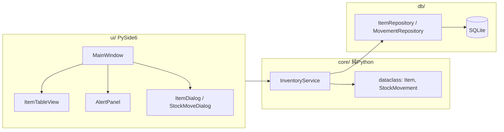

# 備品在庫管理アプリ 企画書

- 作成日: 2026-10-01
- ステータス: ドラフト(要件確定待ち)

---

## 1. 背景と目的

設備管理現場における備品(消耗品・工具等)の在庫を、Excel や紙台帳に代わってローカル PC 上で一元管理する。
在庫が閾値を下回った際に気づける仕組みと、発注先(販売ページ)へ即座にアクセスできる導線を提供し、欠品による作業停止と発注漏れを防ぐ。

## 2. 前提・制約

| 項目 | 内容 |
| --- | --- |
| 利用形態 | ローカルスタンドアロン。単一 PC・単一ユーザーで運用 |
| 同時編集 | 想定しない(複数デバイスからの同時アクセス不要) |
| 技術スタック | Python 3.x / SQLite / PySide6 |
| ネットワーク | オフラインで全機能が動作すること(販売ページを開く操作のみブラウザ経由) |
| 対象 OS | Windows(Inno Setupでインストーラーを作成), Linux(Python環境構築) |

## 3. 主要機能

### 3.1 品目マスタ管理

- 品目の登録・編集・論理削除(廃止)
- 属性: 所有者、管理番号、品名、カテゴリ、保管場所、単位、現在数量、閾値、推奨発注数、販売ページ URL、仕入先、参考価格、備考
- 検索・ソート・絞り込み(所有者、品名、カテゴリ、保管場所、低在庫のみ)

### 3.2 在庫操作

- 入庫 / 出庫 / 棚卸調整
- 全操作を履歴(`stock_movements`)として記録し、数量更新と同一トランザクションで保存
- 品目ごとの履歴閲覧

### 3.3 低在庫アラート

- 品目ごとに閾値を設定し、`数量 <= 閾値` の品目を検出
- 表示方法(3段構え)
  1. 一覧テーブルの該当行を着色
  2. 低在庫一覧を常時表示するアラートパネル(ドック)。件数をバッジ表示
  3. 起動時に低在庫があれば通知(ダイアログまたはトレイ通知)
- 在庫変動後に自動再判定・再描画

### 3.4 販売ページリンク

- 品目に販売ページ URL を保持
- 一覧・アラートパネルから既定ブラウザで開く(`QDesktopServices.openUrl`)
- 入力時に `http` / `https` スキームのみ許可するバリデーション

### 3.5 補助機能

- CSV エクスポート(在庫一覧・履歴)
- 年間・月間のダッシュボード表示、エクスポート
- DB バックアップ(日付付きコピー)
- (要件次第)CSV インポート、発注リスト出力

## 4. システム設計

### 4.1 アーキテクチャ

3層構成。`core/` は PySide6 に依存させず、UI なしで単体テスト可能にする。



### 4.2 ディレクトリ構成(案)

```text
inventory-management-app/
├─ pyproject.toml
├─ docs/
│  └─ 企画書.md
├─ src/inventory_app/
│  ├─ __main__.py          # python -m inventory_app で起動
│  ├─ config.py            # DBパス、既定値(platformdirs でユーザーデータ領域に)
│  ├─ core/
│  │  ├─ models.py         # dataclass
│  │  └─ services.py       # 業務ロジック(入出庫・閾値判定)
│  ├─ db/
│  │  ├─ connection.py     # 接続・PRAGMA・トランザクション
│  │  ├─ schema.sql        # DDL
│  │  ├─ migrations.py     # PRAGMA user_version でバージョン管理
│  │  └─ repositories.py   # SQL をここに閉じ込める
│  └─ ui/
│     ├─ main_window.py
│     ├─ models/item_table_model.py   # QAbstractTableModel
│     ├─ dialogs/
│     └─ widgets/alert_panel.py
└─ tests/
```

### 4.3 DB スキーマ(案)

```sql
CREATE TABLE categories (
  id INTEGER PRIMARY KEY,
  name TEXT NOT NULL UNIQUE
);

CREATE TABLE locations (
  id INTEGER PRIMARY KEY,
  name TEXT NOT NULL UNIQUE
);

CREATE TABLE items (
  id INTEGER PRIMARY KEY,
  owner TEXT NOT NULL,                             -- 所有者
  code TEXT UNIQUE,                                -- 品番・管理番号
  name TEXT NOT NULL,
  category_id INTEGER REFERENCES categories(id),
  location_id INTEGER REFERENCES locations(id),
  unit TEXT DEFAULT '個',
  quantity INTEGER NOT NULL DEFAULT 0 CHECK (quantity >= 0),
  reorder_threshold INTEGER NOT NULL DEFAULT 0,   -- この値以下でアラート
  reorder_quantity INTEGER,                        -- 推奨発注数
  purchase_url TEXT,                               -- 販売ページURL
  supplier TEXT,                                   -- 仕入先(空欄可)
  reference_price INTEGER NOT NULL DEFAULT 0,                        -- 参考価格（日本円想定）
  note TEXT,
  is_active INTEGER NOT NULL DEFAULT 1,            -- 論理削除
  created_at TEXT NOT NULL DEFAULT (datetime('now','localtime')),
  updated_at TEXT NOT NULL DEFAULT (datetime('now','localtime'))
);

CREATE TABLE stock_movements (
  id INTEGER PRIMARY KEY,
  owner TEXT NOT NULL REFERENCES items(owner),   -- 所有者
  item_id INTEGER NOT NULL REFERENCES items(id),
  delta INTEGER NOT NULL,            -- +入庫 / -出庫 / 棚卸差分
  reason TEXT NOT NULL,              -- 'in' | 'out' | 'adjust'
  note TEXT,
  moved_at TEXT NOT NULL DEFAULT (datetime('now','localtime')),
  expense INTEGER NOT NULL REFERENCES items(reference_price)
);

CREATE INDEX idx_movements_item ON stock_movements(item_id, moved_at);
```

設計ポイント:

- `items.quantity` に現在値を持ちつつ、`stock_movements` に全履歴を残す(棚卸時の突合が可能)
- 閾値は品目ごとに保持
- 品目は物理削除せず `is_active` で論理削除(履歴の参照整合性維持)
- 接続時に `PRAGMA foreign_keys = ON; PRAGMA journal_mode = WAL;`

### 4.4 UI 構成

| 画面 | 内容 |
| --- | --- |
| MainWindow | ツールバー(新規/入庫/出庫/棚卸/CSV出力)+検索ボックス、中央に `QTableView`(`QSortFilterProxyModel`)、低在庫ドック |
| ItemDialog | 品目マスタの登録・編集(`QDataWidgetMapper`) |
| StockMoveDialog | 品目選択・数量・理由・メモ |
| Dashboard | 年間・月間の在庫ダッシュボード表示 |
| 履歴ビュー | 品目ダブルクリックでタブ/サブウィンドウ表示 |

### 4.5 技術選定

| 項目 | 選択 | 理由 |
| --- | --- | --- |
| DB アクセス | `sqlite3` 標準モジュール | 単一ユーザーで ORM は過剰 |
| モデル | `dataclass` | 軽量、型ヒントで静的解析と相性良 |
| 設定・DB 保存先 | `platformdirs` | `%APPDATA%` 配下に置き、実行ファイルと分離 |
| マイグレーション | `PRAGMA user_version` + 手書き SQL | 規模的に Alembic は過剰 |
| テスト | pytest + `:memory:` DB | core/ と db/ を UI なしで検証 |
| 配布 | PyInstaller(`--onedir`) | 現場 PC への配布 |
| バックアップ | `sqlite3.Connection.backup()` | メニューから日付付きコピー |

## 5. 実装フェーズ

| フェーズ | 内容 |
| --- | --- |
| 1 | スキーマ・リポジトリ・サービス層 + pytest |
| 2 | MainWindow・テーブル表示・品目 CRUD |
| 3 | 入出庫ダイアログ・履歴表示 |
| 4 | 低在庫の行着色・アラートドック・起動時通知 |
| 5 | 販売ページリンク・CSV エクスポート・バックアップ |
| 6 | ダッシュボード表示・エクスポート |
| 7 | PyInstaller & Inno Setup でパッケージング |

## 6. 要件定義で確定すべき事項

### 6.1 優先度高(スキーマ・構成に直結)

| # | 項目 | 選択肢 | 決定 |
| --- | --- | --- | --- |
| 1 | 管理対象の粒度 | 消耗品の数量管理のみ / 工具・計測器の個体管理(シリアル、貸出返却)も含む | Minimum Viable Productとしては消耗品の数量管理のみ、個体管理への拡張を排除しないように考慮する |
| 2 | 出庫時の付帯情報 | 使用先(設備・案件)・担当者を記録するか | 使用先・担当者を記録する |
| 3 | 「発注済み」ステータス | アラートを一時抑制する発注管理を持つか | 持つ |
| 4 | DB 保存先 | PC ローカル / 共有フォルダ(順番に別 PC で使う可能性) | PC ローカル。デバイス更新時にデータを移行可能な設計とする |
| 5 | CSV インポート | 既存 Excel 等からの初期データ投入の要否と列定義 | 不要 |

### 6.2 管理対象・スコープ

- 品目数の規模感(数十〜数百 / 数千以上)
  - 数百程度を想定。将来的に数千以上に拡張可能な設計とする。
- カテゴリ・保管場所の階層(フラット / 倉庫 > 棚 > 段)
  - カテゴリ: 電球 > LED電球/蛍光灯/白熱球etc. ユーザーが必要に応じて追加・編集可能とする。 
  - 保管場所: フラット
- 単位の種類と、箱⇄個などの換算の要否
  - 単位: 個
  - 換算: 箱⇄個の換算は不要

### 6.3 在庫操作

- 操作種別: 入庫 / 出庫 / 棚卸 の3種で足りるか(返品・廃棄・場所間移動を区別するか)
  - 返品・廃棄を区別する
- 負の在庫: 禁止 / 警告のみで許容
  - 禁止とする
- 棚卸方式: 実数入力→差分自動計算で調整履歴を残す形でよいか
  - 実数入力→差分自動計算で調整履歴を残す形でよい
- 誤操作の取り消し(逆仕訳)の要否
  - 必要

### 6.4 アラート

- 閾値の持ち方: 品目ごと固定 / カテゴリ既定値+個別上書き
  - 品目ごと固定とする
- 判定条件: 閾値以下 / 閾値未満
  - 閾値以下とする
- 通知手段: 起動時ダイアログ / 常時パネル / トレイ通知
  - 起動時ダイアログとする
- 段階: 1段階 / 警告(黄)+危険(赤)の2段階
  - 1段階とする

### 6.5 販売ページリンク

- URL の数: 品目あたり1つ / 複数(仕入先別)
  - 品目あたり1つとする
- 付帯情報: 単価・仕入先名・最終購入日・購入ロット数
- 低在庫品目をまとめた発注リスト出力(CSV/印刷)の要否
  - 不要

### 6.6 データ・運用

- バックアップ: 手動のみ / 起動・終了時に自動世代バックアップ(保持世代数)
  - 手動のみとする
- エクスポート: 在庫一覧・履歴の CSV/Excel 出力
  - CSV出力とする
- 履歴の保持期間: 無期限 / 一定期間で集約・削除
  - 無期限、期間指定して手動削除可とする

### 6.7 ユーザー・権限

- 操作者の識別(ログイン不要でも「担当者選択」が必要か)
  - 必要。入出庫時に担当者を選択する形とする。
- マスタ編集の保護(誰でも可 / 簡易パスワード)
  - 誰でも可能とする。操作担当者の選択で責任の所在を明確にする。

### 6.8 UI・利用環境

- 対象 OS、画面解像度(ノート PC・タブレット)
  - Windows 10 以上、画面解像度 1366x768 以上を想定
- バーコード/QR ハンディスキャナ(キーボード入力型)対応の要否
  - 初期段階では対応しない
- 表示言語(日本語のみ)
  - 日本語のみとする
- 棚ラベル・在庫表の印刷要否
  - 必要とする

### 6.9 非機能・配布

- 配布形態: PyInstaller exe / Python 環境導入
  - WindowsではInno Setup を用いて配布する。Linux等はPython 環境導入を前提とする。
- 更新時の DB マイグレーション方針(前方互換)
  - 前方互換を維持する形でスキーマ変更を行い、必要に応じてマイグレーションスクリプトを提供する。
- オフライン完結(販売ページを開く以外)
  - ネットワーク接続がなくても基本的な在庫管理機能は利用可能とする。

## 7. 今後の進め方

1. 6.1 の優先度高5項目を決定
2. 決定内容を反映してスキーマ・画面一覧を確定版に更新
3. フェーズ1(core/ + db/ + テスト)から実装開始
