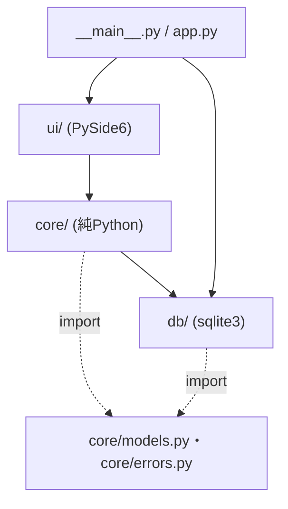
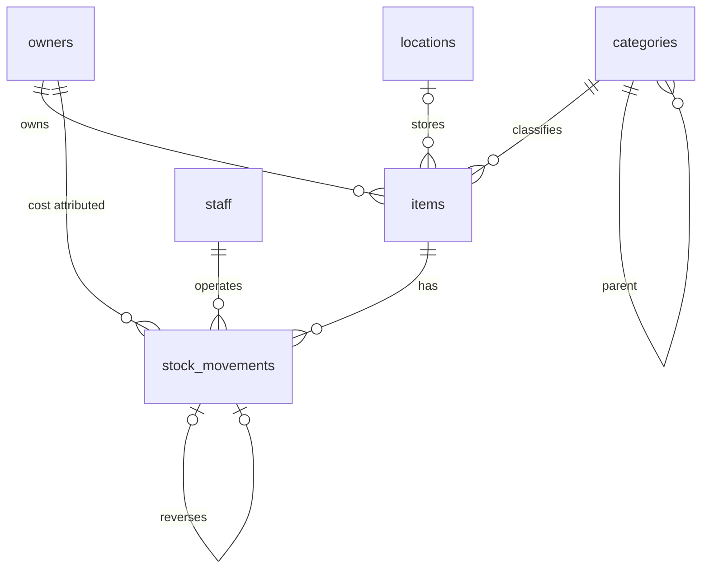
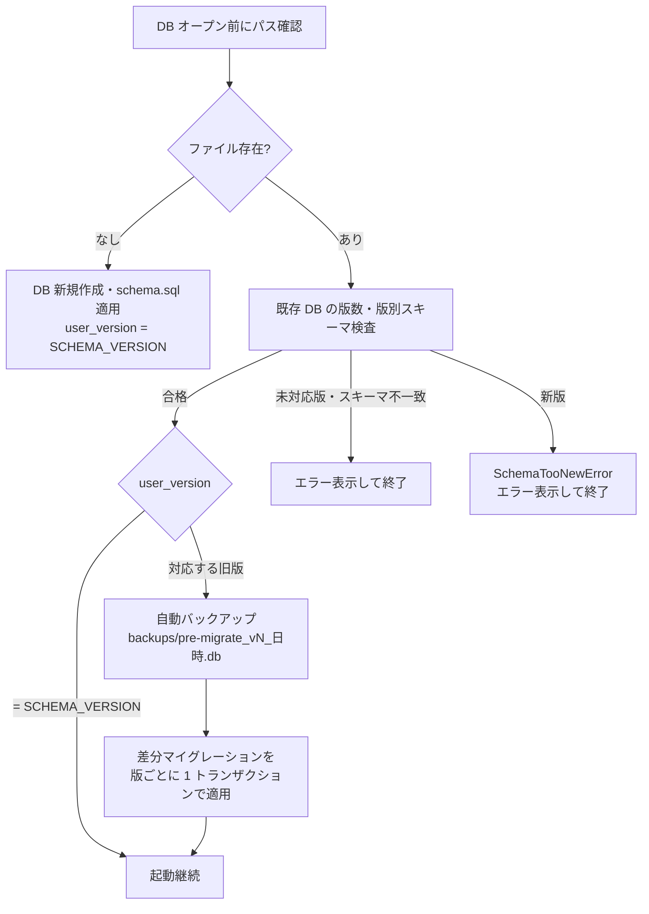
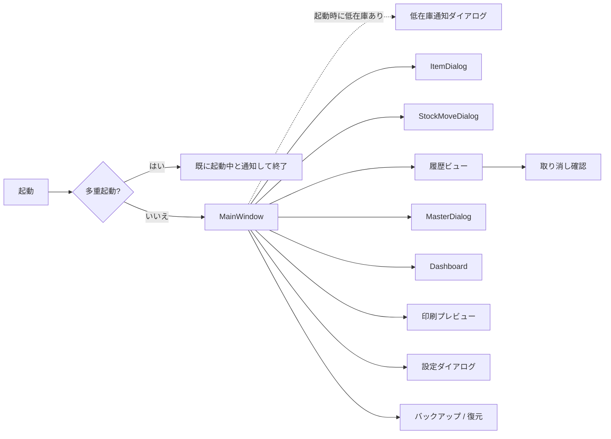
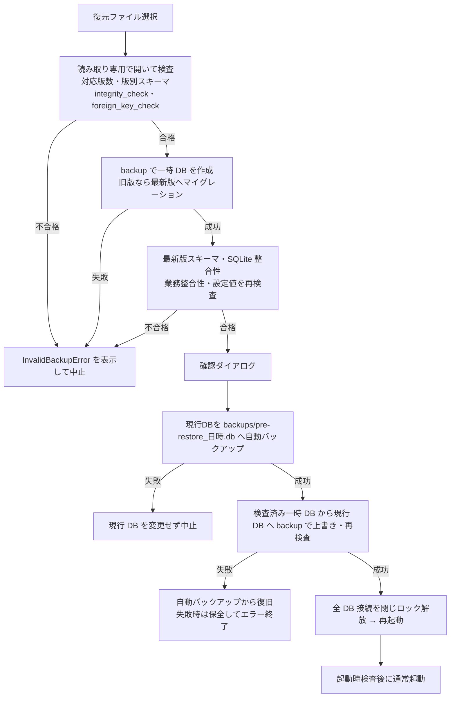

# 備品在庫管理アプリ 開発計画書(基本設計)

- 作成日: 2026-10-01
- ステータス: 内容確定
- 参考文書: [ローカル在庫管理アプリ企画書](ローカル在庫管理アプリ企画書.md)(企画段階の意図の記録。変更しない)
- 位置付け: 企画書の内容(背景・要件・決定事項・設計案)をすべて取り込み、実装可能な粒度に整理した基本設計と開発計画。各フェーズの実装計画書は本書のみを基盤として作成し、企画書の参照は不要とする。企画書と本書の記載が異なる場合は本書を正とする

---

## 1. 概要・スコープ

### 1.1 目的

設備管理現場における備品(消耗品・工具等)の在庫を、Excel や紙台帳に代わってローカル PC 上で一元管理する。在庫が閾値を下回った際に気づける仕組みと、発注先(販売ページ)へ即座にアクセスできる導線を提供し、欠品による作業停止と発注漏れを防ぐ。これをローカルで完結する PySide6 デスクトップアプリとして実現する。

### 1.2 MVP スコープ

| 区分 | 対象 |
| --- | --- |
| 対象 | 品目マスタ管理、関連マスタ管理、在庫操作(入庫・出庫・返品・廃棄・棚卸・取り消し)、履歴閲覧、低在庫アラート、販売ページリンク、CSV エクスポート、ダッシュボード、印刷(棚ラベル・在庫表)、手動バックアップ・復元、多重起動防止、Windows インストーラー |
| 対象外 | 個体管理(シリアル・貸出返却)、CSV インポート、履歴の期間指定削除、バーコード/QR スキャナ対応、発注リスト出力、「発注済み」ステータス、多言語対応、単位換算(箱⇄個など)、自動世代バックアップ |

### 1.3 用語

| 用語 | 定義 |
| --- | --- |
| 所有者 | 在庫の法的帰属先。費用帰属の単位 |
| 担当者 | アプリの操作者。全在庫操作で選択する |
| 品目 | 在庫管理の単位。管理番号で一意に識別 |
| 廃止 | 品目の論理削除(`items.is_active = 0`)。再有効化可能 |
| 無効化 | 所有者・担当者の論理削除(`is_active = 0`)。新規選択肢から除外 |
| 在庫操作 | `stock_movements` に 1 行を追加し、`items.quantity` を更新する処理 |
| 取り消し | 元操作の `delta` を符号反転した行を追加する逆仕訳 |
| 有効な操作 | 取り消し行でも、取り消された行でもない操作 |
| 低在庫 | 有効品目で `quantity <= reorder_threshold` |
| 管理番号 | 品目の識別コード。`接頭辞-連番4桁`(例: `LED-0001`)。登録時に自動採番し不変 |
| 返品 | 仕入先へ返す操作(在庫減) |
| 廃棄 | 在庫を破棄する操作(在庫減)。支出額とは別に集計する |
| 棚卸 | 実数を入力し、現在数との差分を調整履歴として記録する操作 |

### 1.4 前提・制約

| 項目 | 内容 |
| --- | --- |
| 利用形態 | ローカルスタンドアロン。単一 PC・単一ユーザーで運用 |
| 同時編集 | 想定しない(複数デバイスからの同時アクセス不要)。多重起動は 7.1 で防止 |
| 技術スタック | Python 3.13 / SQLite / PySide6(2.1) |
| ネットワーク | オフラインで全機能が動作すること(販売ページを開く操作のみブラウザ経由) |
| 対象 OS | Windows 10 以上(Inno Setup でインストーラーを作成)、Linux(Python 環境を構築して実行) |
| 画面解像度 | 1366×768 以上 |
| 表示言語 | 日本語のみ |
| 時刻 | DB は UTC で保存し、表示(UI・CSV・印刷)は OS のローカルタイムゾーン(サマータイム対応)で行う(3.4) |
| 規模 | 品目は数百程度を想定。数千以上へ拡張可能な設計とする(性能目標は 7.5) |
| DB 保存先 | PC ローカル。デバイス更新時は手動バックアップ・復元でデータを移行する(7.2) |

### 1.5 要件定義の決定事項

| 項目 | 決定 | 反映先 |
| --- | --- | --- |
| 管理対象の粒度 | MVP は消耗品の数量管理のみ。個体管理への拡張を排除しない設計とする | 1.6 |
| 単位 | 「個」のみ。箱⇄個などの換算は行わない | 4.2 |
| 出庫時の付帯情報 | 使用先(設備・案件)と担当者を記録する | 5.2 |
| 「発注済み」ステータス | 持たない。入庫で閾値を上回れば自動的にアラートが解除される | 5.5 |
| 負の在庫 | 禁止 | 5.2 |
| 棚卸方式 | 実数入力 → 差分を自動計算し、調整履歴に記録 | 5.2 |
| 誤操作の取り消し | 逆仕訳で対応する | 5.3 |
| 返品・廃棄 | 区別する(返品は仕入先へ返す。いずれも在庫減) | 5.2、5.7 |
| 廃止品目 | 在庫が残っていても廃止可能 | 5.1 |
| 低在庫の閾値 | 品目ごとに固定値。判定は閾値以下。1 段階 | 5.5 |
| アラート通知 | 起動時ダイアログ、一覧の行着色、アラートドックの 3 段構え(トレイ通知は行わない) | 5.5、6.3 |
| 販売ページ | 1 品目 1 URL。単価・仕入先・最終購入日・購入ロット数を併せて表示 | 5.1、5.6 |
| 発注リスト出力 | 不要 | 1.2 |
| CSV インポート | 不要(既存 Excel 等からの初期データ投入は行わない) | 1.2 |
| エクスポート | CSV 出力(在庫一覧・履歴・ダッシュボード) | 5.8 |
| バックアップ | 手動のみ。起動・終了時の自動世代バックアップは行わない | 7.2 |
| 履歴の保持期間 | 無期限。期間指定の手動削除は保留(MVP 対象外) | 1.6 |
| ダッシュボード | 所有者ごとに年間・月間の入庫数・出庫数・支出額(出庫基準)をグラフ化。廃棄は支出額に含めず別集計 | 5.7 |
| 操作者の識別 | ログインは不要。入出庫時に担当者を選択する | 5.2、7.6 |
| マスタ編集の保護 | 誰でも編集可。担当者の選択で責任の所在を明確にする | 7.6 |
| バーコード/QR スキャナ | 初期段階では対応しない | 1.2 |
| 配布 | Windows は Inno Setup で配布。Linux は Python 環境導入を前提とする | 9.2 |
| DB マイグレーション | 前方互換を維持してスキーマ変更を行い、必要に応じてマイグレーションを提供する。古い DB は自動移行し、アプリより新しい DB は開かない | 4.4 |

### 1.6 将来拡張の方針

MVP 対象外だが、設計上これらを妨げないようにする。

- 個体管理(工具・計測器のシリアル管理、貸出返却): `assets(item_id, serial, ...)` テーブルを追加し、管理番号に枝番(例: `LED-0001-001`)を付与する形で拡張する。現行のスキーマ・管理番号形式は変更不要とする
- 履歴の期間指定による手動削除(保留): 実装する場合は、年単位で削除し、実行前に自動バックアップを取得する。取り消しの組は一緒に削除し、ダッシュボード用に月別集計を事前に退避する
- 規模拡張: 品目数千件以上でも成立するよう、一覧はモデル/ビュー(`QAbstractTableModel`)で扱い、必要なインデックスを DB に持たせる

---

## 2. 開発環境・体制

### 2.1 ツールチェーン

| 項目 | 選択 |
| --- | --- |
| Python | 3.13(`requires-python = ">=3.13"`) |
| パッケージ管理 | uv(`pyproject.toml` + `uv.lock` をコミット) |
| ビルドバックエンド | hatchling(`src/` レイアウト) |
| 主要依存 | PySide6、platformdirs |
| 開発依存 | pytest、pytest-qt、pytest-cov、ruff、pyright、pyinstaller、tzdata(Windows で `ZoneInfo` を使うタイムゾーンのテスト用) |
| リンタ/フォーマッタ | ruff(`ruff check` / `ruff format`) |
| 型検査 | pyright(`core/`・`db/` は strict、`ui/` は standard) |
| CI | GitHub Actions(`windows-latest` / `ubuntu-latest`) |

### 2.2 CI パイプライン

1. `uv sync --locked`
2. `uv run ruff check` / `uv run ruff format --check`
3. `uv run pyright`
4. `uv run pytest --cov`(Linux は `QT_QPA_PLATFORM=offscreen`、Qt 実行に必要な OS パッケージを導入)
5. (フェーズ 8 以降)タグ push 時に Windows で PyInstaller + Inno Setup を実行し成果物を保存

### 2.3 開発ルール

- ブランチ: `main` は常にテスト成功状態。作業は `feature/<フェーズ>-<内容>` で行い PR でマージ
- コミットメッセージ: Conventional Commits(`feat:` / `fix:` / `test:` / `docs:` など)
- バージョン: SemVer。アプリ版数は `pyproject.toml`、スキーマ版数は `db/migrations.py` の `SCHEMA_VERSION` で管理(両者は独立)

### 2.4 技術選定の理由

| 項目 | 選択 | 理由 |
| --- | --- | --- |
| DB アクセス | `sqlite3` 標準モジュール | 単一ユーザーで ORM は過剰 |
| モデル | `dataclass` | 軽量。型ヒントで静的解析と相性が良い |
| 設定・DB 保存先 | `platformdirs` | `%APPDATA%` 配下に置き、実行ファイルと分離する |
| マイグレーション | `PRAGMA user_version` + 手書き SQL | 規模的に Alembic は過剰 |
| テスト | pytest + `:memory:` DB(必要に応じ実ファイル DB) | `core/`・`db/` を UI なしで検証できる |
| グラフ | `QtCharts`(PySide6 同梱) | 追加依存なし |
| 印刷 | `QPrinter` / `QPrintPreviewDialog` / `QPainter` | ラベル面付けを座標指定で制御できる。切り捨ては `QFontMetrics.elidedText` で描画幅を基準にする |
| 配布 | PyInstaller(`--onedir`)+ Inno Setup | Windows 現場 PC への配布。Linux は Python 環境導入 |
| バックアップ | `sqlite3.Connection.backup()` | メニューから日付付きコピー・復元を行える |

---

## 3. アーキテクチャ

### 3.1 層構成と依存方向



- 業務処理の呼び出し方向は `ui → core の Service → db` の一方向とする
- import 依存では、`db/` から純粋なモデル・業務例外(`core/models.py`・`core/errors.py`)への参照を許可する。`db/` から Service・ReportService・UI への参照は禁止する
- `core/models.py`・`core/errors.py` は `db/`・Service・UI に依存させず、循環 import を防ぐ。`core/` と `db/` は PySide6 を import しない(静的検査・依存ルールのテストで担保)
- UI は Service のみを呼び出し、Repository や SQL を直接扱わない
- Service はトランザクション境界を持つ。1 つの業務操作 = 1 トランザクション
- 復元全体は複数 DB を扱うため、上記の単一トランザクションの例外とする。`BackupService` が保全・上書き・検査・失敗時復旧の手順を統括し、各版のマイグレーションは個別のトランザクションで行う(7.2)

### 3.2 モジュール構成

| モジュール | 責務 |
| --- | --- |
| `__main__.py` | エントリポイント。`app.main()` を呼ぶ |
| `app.py` | 起動シーケンス(多重起動チェック → ログ初期化 → DB オープン・マイグレーション → MainWindow 表示 → 低在庫通知)、全 DB 接続の終了管理、復元後のロック解放・再起動 |
| `config.py` | パス解決(platformdirs)、定数 |
| `core/models.py` | dataclass(`Item`、`StockMovement`、`Owner`、`Staff`、`Category`、`Location`、`ItemFilter`、`PurchaseInfo` 等) |
| `core/errors.py` | 業務例外 |
| `core/timeutil.py` | UTC 現在時刻の取得、UTC⇔ローカル変換、ローカル暦期間の UTC 境界計算(3.4) |
| `core/services.py` | `InventoryService`、`MasterService`、`SettingsService`、`BackupService`(バックアップ・復元手順の統括、業務整合性・設定値の検証) |
| `core/reports.py` | `ReportService`(ダッシュボード集計、CSV 出力) |
| `db/connection.py` | 通常・読み取り専用・メモリ DB の接続生成、接続種別に応じた PRAGMA 設定、`transaction()` コンテキストマネージャ |
| `db/schema.sql` | 最新 DDL |
| `db/migrations.py` | `SCHEMA_VERSION`・`MIN_SUPPORTED_SCHEMA_VERSION`、版別スキーマ検査、バージョン判定、マイグレーション適用 |
| `db/repositories.py` | `ItemRepository`、`MovementRepository`、`MasterRepository`、`SettingsRepository` |
| `db/backup.py` | DB コピー、SQLite 整合性検査。版別スキーマ検査・移行は `db/migrations.py`、業務検査用データの取得は Repository が担当し、いずれも Service は呼ばない |
| `ui/single_instance.py` | 多重起動防止(`QLockFile`) |
| `ui/main_window.py` ほか | 画面(6 章) |

### 3.3 業務例外

すべて `core/errors.py` の `DomainError` を基底とし、UI は `DomainError` を捕捉してメッセージを表示する。それ以外の例外はログ出力の上で汎用エラーダイアログを表示する。

| 例外 | 発生条件 |
| --- | --- |
| `ValidationError` | 入力値不正(必須欠落、URL スキーム不正、接頭辞形式不正、数量 0 以下 等) |
| `NegativeStockError` | 操作・取り消しの結果、在庫が負になる |
| `InactiveItemError` | 廃止品目への在庫操作・取り消し |
| `InactiveMasterError` | 無効化済み所有者・担当者の新規選択 |
| `AlreadyReversedError` | 取り消し済みの操作の再取り消し |
| `ReversalNotAllowedError` | 取り消し行の取り消し、差分 0 の棚卸記録の取り消し |
| `CategoryCycleError` | カテゴリの親に自身または子孫を指定 |
| `PrefixLockedError` | 使用済み接頭辞の変更 |
| `MasterInUseError` | 使用中マスタ、または採番実績のあるカテゴリの削除 |
| `SchemaTooNewError` | アプリより新しいスキーマの DB を開こうとした |
| `InvalidBackupError` | 復元対象の版数・スキーマ・SQLite 整合性・業務整合性・設定値の検査不合格、または一時 DB の移行・再検査失敗 |

### 3.4 DB 接続・トランザクション

- 全接続で `autocommit=True` を指定し、書き込みトランザクションは明示制御する。通常接続と復元元の検査用接続を分け、接続種別に応じて設定する

| 接続種別 | 開き方・接続直後の設定 |
| --- | --- |
| 通常の実ファイル DB | `sqlite3.connect(path, autocommit=True)`。`PRAGMA foreign_keys = ON; PRAGMA journal_mode = WAL; PRAGMA busy_timeout = 5000;` |
| 復元元の検査用 DB | URI の `mode=ro` と `uri=True` で読み取り専用接続。`PRAGMA foreign_keys = ON; PRAGMA busy_timeout = 5000;` のみ設定し、ジャーナルモードは変更しない |
| テスト用メモリ DB | `sqlite3.connect(":memory:", autocommit=True)`。`PRAGMA foreign_keys = ON; PRAGMA busy_timeout = 5000;` を設定し、WAL は要求しない |

- 読み取り専用接続では DDL・マイグレーション・永続設定の変更を行わない。復元元の移行は、コピー先の書き込み可能な一時 DB で実施する
- `transaction(conn)` は `conn.execute("BEGIN IMMEDIATE")` → 正常終了で `conn.execute("COMMIT")`、例外で `conn.execute("ROLLBACK")`。COMMIT 失敗時もトランザクションが残っていれば ROLLBACK する
- `autocommit=True` では `conn.commit()`・`conn.rollback()`・`with conn:` による終了処理は無効のため、使用しない。Service とマイグレーションは上記の明示 SQL に統一する
- `sqlite3.IntegrityError`(CHECK・UNIQUE 違反)は Repository で対応する業務例外に変換する。業務ルールは Service で事前検査し、DB 制約は最終防衛線とする
- 日時は `'YYYY-MM-DD HH:MM:SS'` 形式の UTC 文字列で保存する。表示(UI・CSV・印刷・ファイル名)のみ OS のローカルタイムゾーンへ変換する
- 現在時刻の取得とタイムゾーン変換は `core/timeutil.py` に集約し、それ以外で `datetime.now()` や SQLite の `'localtime'` を使用しない。`core/models.py` の dataclass は DB と同じ UTC 文字列を保持し、変換は表示層で行う
- `core/timeutil.py` の主な関数(`tz` 引数の既定 `None` は OS ローカルで、テストでは `ZoneInfo` を注入する):

| 関数 | 役割 |
| --- | --- |
| `utc_now_str(now=None)` | UTC 現在時刻を DB 形式で返す。`now` はテスト用の注入口 |
| `to_local(utc_str, tz=None)` | UTC 文字列を tz 付きのローカル `datetime` に変換する |
| `format_local(utc_str, tz=None)` | 表示用の `'YYYY-MM-DD HH:MM:SS'`(ローカル)を返す |
| `local_date(utc_str, tz=None)` | ローカル日付を返す |
| `local_range_to_utc(start, end, tz=None)` | ローカル暦の半開区間 `[start, end)` を UTC 文字列の組に変換する |

- Service は `moved_at` を `utc_now_str()` で明示的に設定する。DB の `DEFAULT` は最終防衛線とする

### 3.5 ファイル配置

| 種別 | 場所 |
| --- | --- |
| DB | `user_data_dir("inventory-manager-mini", appauthor=False, roaming=True)/inventory.db`(Windows: `%APPDATA%\inventory-manager-mini\`) |
| バックアップ既定保存先 | 同上 `/backups/`(保存時に変更可) |
| ロックファイル | 同上 `/inventory.lock` |
| ログ | `user_log_dir(...)/app.log`(`RotatingFileHandler`、1 MB × 5 世代) |

### 3.6 ディレクトリ構成(案)

```text
inventory-management-app/
├─ pyproject.toml / uv.lock
├─ README.md                 # 起動手順(Linux: uv sync → uv run python -m inventory_manager_mini)
├─ .github/workflows/        # CI・リリース(フェーズ 0・8)
├─ docs/
│  ├─ ローカル在庫管理アプリ企画書.md      # 企画段階の意図(参考。変更しない)
│  └─ ローカル在庫管理アプリ開発計画書.md  # 本書
├─ scripts/                  # ダミーデータ生成(フェーズ 1)
├─ packaging/                # PyInstaller spec・Inno Setup スクリプト(フェーズ 8)
├─ src/inventory_manager_mini/
│  ├─ __main__.py            # python -m inventory_manager_mini で起動
│  ├─ app.py                 # 起動シーケンス
│  ├─ config.py              # DB パス・既定値(platformdirs)
│  ├─ core/                  # models.py / errors.py / services.py / reports.py / timeutil.py
│  ├─ db/                    # connection.py / schema.sql / migrations.py / repositories.py / backup.py
│  └─ ui/
│     ├─ single_instance.py
│     ├─ main_window.py
│     ├─ models/item_table_model.py   # QAbstractTableModel
│     ├─ dialogs/                     # 品目・在庫操作・マスタ管理・設定・取り消し確認
│     ├─ widgets/                     # alert_panel.py、dashboard.py(QtCharts)、履歴ビュー
│     └─ printing/                    # 棚ラベル・在庫表
└─ tests/                    # conftest.py(共通フィクスチャ)ほか
```

---

## 4. DB 基本設計

### 4.1 ER 図



### 4.2 スキーマ

初版(`SCHEMA_VERSION = 1`)の DDL。`db/schema.sql` の元とする。

```sql
CREATE TABLE owners (
  id INTEGER PRIMARY KEY,
  name TEXT NOT NULL UNIQUE,
  is_active INTEGER NOT NULL DEFAULT 1 CHECK (is_active IN (0, 1))
);

CREATE TABLE staff (
  id INTEGER PRIMARY KEY,
  name TEXT NOT NULL UNIQUE,
  is_active INTEGER NOT NULL DEFAULT 1 CHECK (is_active IN (0, 1))
);

CREATE TABLE categories (
  id INTEGER PRIMARY KEY,
  parent_id INTEGER REFERENCES categories(id),
  name TEXT NOT NULL,
  code_prefix TEXT NOT NULL UNIQUE
    CHECK (length(code_prefix) BETWEEN 2 AND 5 AND code_prefix NOT GLOB '*[^A-Z0-9]*'),
  next_seq INTEGER NOT NULL DEFAULT 1   -- 廃止品目の番号を再利用しないため MAX() ではなく保持
);
-- UNIQUE(parent_id, name) では NULL 同士が重複扱いされないため式インデックスで担保
CREATE UNIQUE INDEX uq_categories_parent_name ON categories(COALESCE(parent_id, 0), name);

CREATE TABLE locations (
  id INTEGER PRIMARY KEY,
  name TEXT NOT NULL UNIQUE
);

CREATE TABLE items (
  id INTEGER PRIMARY KEY,
  owner_id INTEGER NOT NULL REFERENCES owners(id),
  code TEXT NOT NULL UNIQUE,                       -- 管理番号(自動採番・不変)
  name TEXT NOT NULL,
  category_id INTEGER NOT NULL REFERENCES categories(id),
  location_id INTEGER REFERENCES locations(id),
  unit TEXT NOT NULL DEFAULT '個' CHECK (unit = '個'),
  quantity INTEGER NOT NULL DEFAULT 0 CHECK (quantity >= 0),
  reorder_threshold INTEGER NOT NULL DEFAULT 0 CHECK (reorder_threshold >= 0),  -- この値以下でアラート
  reorder_quantity INTEGER CHECK (reorder_quantity > 0),                         -- 推奨発注数
  purchase_url TEXT,
  supplier TEXT,
  manufacturer_part_number TEXT,                         -- メーカー型番(NULL 可)
  application TEXT,                                      -- 用途(NULL 可)
  reference_price INTEGER CHECK (reference_price >= 0),  -- 参考価格(円)。NULL は未登録
  note TEXT,
  is_active INTEGER NOT NULL DEFAULT 1 CHECK (is_active IN (0, 1)),
  created_at TEXT NOT NULL DEFAULT (datetime('now')),  -- UTC
  updated_at TEXT NOT NULL DEFAULT (datetime('now'))   -- UTC
);

CREATE TRIGGER trg_items_updated_at AFTER UPDATE ON items
WHEN NEW.updated_at = OLD.updated_at
BEGIN
  UPDATE items SET updated_at = datetime('now') WHERE id = NEW.id;
END;

CREATE TABLE stock_movements (
  id INTEGER PRIMARY KEY,
  item_id INTEGER NOT NULL REFERENCES items(id),
  owner_id INTEGER NOT NULL REFERENCES owners(id),   -- 費用帰属を記録時点で固定
  staff_id INTEGER NOT NULL REFERENCES staff(id),
  reason TEXT NOT NULL CHECK (reason IN ('in','out','return','dispose','adjust')),
  delta INTEGER NOT NULL,
  unit_price INTEGER CHECK (unit_price >= 0),         -- 単価(4.3 の規則)
  used_for TEXT,                                      -- 使用先(設備・案件)
  reversal_of INTEGER UNIQUE REFERENCES stock_movements(id),  -- UNIQUE で二重取り消しを防止
  note TEXT,
  moved_at TEXT NOT NULL DEFAULT (datetime('now')),   -- UTC
  CHECK (
    reversal_of IS NOT NULL
    OR (reason = 'in' AND delta > 0)
    OR (reason IN ('out','return','dispose') AND delta < 0)
    OR reason = 'adjust'
  )
);

CREATE INDEX idx_movements_item ON stock_movements(item_id, moved_at);
CREATE INDEX idx_movements_owner_date ON stock_movements(owner_id, moved_at);

CREATE TABLE settings (
  key TEXT PRIMARY KEY,
  value TEXT NOT NULL
);
INSERT INTO settings (key, value) VALUES ('fiscal_year_start_month', '4');
```

| キー | 型(値の解釈) | 既定 | 用途 |
| --- | --- | --- | --- |
| `fiscal_year_start_month` | 整数 1〜12 | `4` | ダッシュボードの年度区切り |

設定値の型変換・範囲検証は `SettingsService` で行う。

設計ポイント:

- `items.quantity` に現在値を持ちつつ、`stock_movements` に全履歴を残す(棚卸時の突合が可能)
- 閾値は品目ごとに保持する
- 品目は物理削除せず `is_active` で論理削除する(履歴の参照整合性を維持)
- 接続時の PRAGMA は 3.4、管理番号の採番は 5.1、カテゴリの循環参照禁止は 5.4 を参照
- 取り消しは元行と同じ `reason` で `delta` を符号反転した行を追加し、`reversal_of` に元行 ID を設定する。集計時に自動で相殺される(5.7)
- `stock_movements.owner_id` は操作時点の品目所有者をコピーする。所有者変更後も過去の費用帰属を維持する(4.3)
- 将来の個体管理は 1.6 の方針で拡張する

### 4.3 カラム運用ルール

| テーブル.カラム | ルール |
| --- | --- |
| `items.quantity` | 在庫操作(Service)経由でのみ更新。品目編集では変更不可 |
| `items.code` | 登録時に採番し以後不変 |
| `items.unit` | MVP は「個」固定。Service が登録時に固定値を設定し、「個」以外を受け付けない。品目編集では変更不可。DB の CHECK 制約でも担保する |
| `items.manufacturer_part_number`・`items.application` | 任意入力。前後の空白を除去し、空文字は NULL に正規化して保存する(最大長制限なし) |
| `stock_movements.owner_id` | 通常操作: 操作時点の `items.owner_id`。取り消し行: 元行の `owner_id` |
| `stock_movements.staff_id` | 初期数量の履歴を含む全操作で、有効な担当者の選択を必須とする。取り消し行は取り消し操作者を記録する |
| `stock_movements.unit_price` | 入庫: 入力された実単価(既定は参考価格)。出庫・返品・廃棄・棚卸: 操作時点の `items.reference_price`。取り消し行: 元行の `unit_price` |
| `stock_movements.moved_at` | 常に記録時刻(UTC。遡り入力不可)。Service が `utc_now_str()` で設定する |
| `stock_movements.used_for` | 出庫時必須。取り消し行は元行をコピー |
| `categories.next_seq` | 採番時に読み出し・インクリメント。`next_seq > 1` で接頭辞変更・カテゴリ削除不可。品目のカテゴリ変更後も値を保持する |

### 4.4 マイグレーション



- 初版は `SCHEMA_VERSION = 1`、`MIN_SUPPORTED_SCHEMA_VERSION = 1`。既存 DB の `user_version = 0` は未対応として拒否し、新規作成とは区別する
- 対応版数は `MIN_SUPPORTED_SCHEMA_VERSION <= user_version <= SCHEMA_VERSION` とし、旧版から最新版までのマイグレーションがすべて存在することを検査する
- 版ごとの必須テーブル・列(型・NOT NULL・主キーを含む)・CHECK/UNIQUE/FK 制約・必要なインデックス/トリガーの検査定義を `migrations.py` に保持する。起動時と復元前で同じ検査を使用し、旧版を最新版の定義で検査しない
- マイグレーションは `migrations.py` に `{版数: SQL}` として手書きで追加する。各版の適用と `PRAGMA user_version` 更新を同一トランザクションで行う
- 各版の適用後にその版のスキーマを検査してから COMMIT する。新規作成も DDL 適用・検査・`user_version` 設定を同一トランザクションで行う
- スキーマ変更は前方互換(列追加・テーブル追加中心)を原則とする
- マイグレーション失敗時はロールバックし、バックアップの場所を示してエラー終了する

---

## 5. 業務ルール

### 5.1 品目

| 操作 | ルール |
| --- | --- |
| 属性 | 所有者(マスタから選択、変更可)、管理番号(自動採番)、品名、メーカー型番、用途、カテゴリ(必須)、保管場所、単位(「個」固定、表示のみ)、現在数量、閾値、推奨発注数、販売ページ URL、仕入先、参考価格、備考 |
| 管理番号 | 形式は `接頭辞-連番4桁`(例: `LED-0001`)。品目のカテゴリに設定された接頭辞から登録時に自動生成する。登録後は不変で、カテゴリ変更・接頭辞変更でも再採番しない。連番は接頭辞(カテゴリ)ごとで、廃止品目の番号は再利用しない。既存の管理番号(Excel・紙台帳等)は引き継がない |
| 登録 | 所有者(有効)・品名・カテゴリ必須。初期数量(既定 0)・閾値(既定 0)入力可。管理番号採番と品目 INSERT を同一トランザクションで行う。初期数量が 1 以上なら有効な担当者を必須選択とし、その `staff_id` で `reason='adjust'`・`delta=初期数量` の履歴を同時に記録する。初期数量 0 では担当者不要・履歴なし |
| 採番 | `UPDATE categories SET next_seq = next_seq + 1 WHERE id = ? RETURNING next_seq - 1` で連番を確保し、`code_prefix \|\| '-' \|\| printf('%04d', seq)` を生成。10000 以降は 5 桁となる |
| 編集 | 管理番号・現在数量・単位以外を編集可。単位は新規・編集ともに入力させず、「個」を表示する。所有者変更は有効な所有者のみ。現在の所有者が無効化済みでも、変更せず維持する編集は可。過去履歴の `owner_id` は変更しない |
| 販売ページ URL | 1 品目 1 件。空欄可。入力時は `urllib.parse` で解析し、スキーム `http`/`https` かつホスト名ありのみ許可 |
| 廃止 | 在庫残の有無に関わらず可能。確認ダイアログを表示 |
| 再有効化 | いつでも可能 |
| 廃止品目 | アラート対象外、一覧既定非表示、在庫操作・取り消し不可、編集は可 |

### 5.2 在庫操作

| 操作 | reason | delta | 必須入力 | unit_price |
| --- | --- | --- | --- | --- |
| 入庫 | `in` | +数量 | 担当者、数量 | 参考価格を既定値として実単価を上書き入力可 |
| 出庫 | `out` | −数量 | 担当者、数量、使用先 | 操作時点の参考価格 |
| 返品 | `return` | −数量 | 担当者、数量 | 操作時点の参考価格 |
| 廃棄 | `dispose` | −数量 | 担当者、数量 | 操作時点の参考価格 |
| 棚卸 | `adjust` | 実数 − 現在数 | 担当者、実数 | 操作時点の参考価格 |

- 数量は 1 以上の整数。棚卸の実数は 0 以上の整数で、差分 0 でも記録する
- 入庫時に実単価が参考価格と異なる場合、「参考価格を更新しますか」と確認し、了承時は同一トランザクションで `items.reference_price` を更新する
- 減少操作で `quantity + delta < 0` となる場合は `NegativeStockError`
- 処理順: 検証 → `stock_movements` INSERT → `items.quantity` UPDATE(同一トランザクション)
- 担当者は全操作で有効なもののみ新規選択可。所有者は品目登録・所有者変更時に有効なもののみ新規選択可(過去履歴の表示には無効化済みも表示)
- 有効品目の現在の所有者が無効化済みでも、通常の在庫操作は許可する。既存参照として `items.owner_id` を履歴へコピーし、所有者の有効性では拒否しない

### 5.3 取り消し

- 新規行: `reason`・`owner_id`・`unit_price`・`used_for` は元行をコピー、`delta = −元delta`、`reversal_of = 元行id`、`staff_id` は取り消し操作者、`moved_at` は記録時刻、`note` は任意入力
- 入庫トランザクションで参考価格を更新した場合でも、当該入庫履歴の取り消しでは `items.reference_price` を戻さない。取り消し行の `unit_price` は元行からコピーし、取り消し時点の参考価格には置き換えない
- 取り消し操作者は有効な担当者を必須選択とする。元行の所有者・担当者が無効化済みでも取り消しは可。元行の `owner_id` は既存参照としてコピーし、現在の所有者への置換や有効性による拒否は行わない
- 取り消し不可条件:
  - 元行が取り消し行(`reversal_of IS NOT NULL`) → `ReversalNotAllowedError`
  - 元行が取り消し済み(`reversal_of` の UNIQUE 制約でも担保) → `AlreadyReversedError`
  - 元行が `adjust` かつ `delta = 0` → `ReversalNotAllowedError`
  - 品目が廃止 → `InactiveItemError`(再有効化後に取り消す)
  - 取り消し後の在庫が負 → `NegativeStockError`
- 初期数量の `adjust` も上記条件を満たせば取り消し可能

### 5.4 マスタ管理

| マスタ | 使用中または保持必須の判定 | 未使用・保持不要時 | 使用中・保持必須時 |
| --- | --- | --- | --- |
| 所有者 | `items` または `stock_movements` から参照 | 物理削除可 | 無効化のみ可(再有効化可) |
| 担当者 | `stock_movements` から参照 | 物理削除可 | 無効化のみ可(再有効化可) |
| カテゴリ | `items` から参照、子カテゴリあり、または `next_seq > 1`(採番実績あり) | 参照・子カテゴリなし、かつ `next_seq = 1` の場合のみ物理削除可 | 削除不可(`MasterInUseError`) |
| 保管場所 | `items` から参照 | 物理削除可 | 削除不可 |

- 所有者: 在庫の法的帰属先。検索・絞り込み・費用帰属に使用する。品目の所有者は変更可
- 担当者: アプリの操作者。在庫操作時に選択する
- カテゴリ: 階層構造(例: 電球 > LED電球)。ユーザーが必要に応じて追加・編集できる。上位カテゴリにも品目を直接割り当て可。各カテゴリに管理番号用の接頭辞を設定する
- 保管場所: フラット(階層なし)
- カテゴリの親変更時、新しい親が自身または子孫であれば `CategoryCycleError`(再帰 CTE で子孫を取得して判定)
- カテゴリ名は同一親の下で一意(式インデックス)
- 接頭辞は英大文字・数字 2〜5 文字、全カテゴリで一意。`next_seq > 1`(採番実績あり)の場合は変更不可
- 採番済みカテゴリは、全品目が別カテゴリへ変更されても接頭辞・`next_seq` を保持する。削除・同じ接頭辞での再作成による連番の初期化を防ぎ、既存管理番号との衝突を避ける
- 所有者・担当者の無効化は新規選択肢からの除外のみとし、既存の品目・履歴の参照は維持する。所有者を無効化しても品目の廃止や在庫操作禁止には連動させない(5.1〜5.3)
- 名称の変更はすべてのマスタで可能

### 5.5 低在庫判定

```sql
SELECT ... FROM items WHERE is_active = 1 AND quantity <= reorder_threshold;
```

- 閾値は品目ごとの固定値(カテゴリ既定値・個別上書きは持たない)。判定は閾値以下の 1 段階のみ
- 「発注済み」によるアラートの一時抑制は行わない。入庫で数量が閾値を上回れば、再判定によりアラートは自動的に解除される
- 表示は 3 段構え: (1) 一覧テーブルの該当行を着色、(2) 低在庫一覧を常時表示するアラートパネル(ドック。件数をバッジ表示)、(3) 起動時に低在庫があればダイアログで通知(トレイ通知は行わない)
- 在庫操作・取り消し・品目編集(閾値変更)・廃止/再有効化の後に再判定し、テーブル着色・アラートパネル・バッジを更新する
- 再判定は Service 完了後に UI 側の `DataChanged` 通知(Qt シグナル)で一括実行する

### 5.6 販売ページ・最終購入日・購入ロット数

販売ページは MainWindow の一覧・低在庫ドック・ItemDialog から既定ブラウザで開く(`QDesktopServices.openUrl`。URL の検証は 5.1・7.4)。付帯情報として単価(参考価格)・仕入先・最終購入日・購入ロット数(前回の入庫数)を表示する。

最終購入日・購入ロット数は、取り消されていない直近の入庫行から求める。最終購入日は `moved_at`(UTC)を `timeutil.local_date` で OS ローカルの日付に変換して表示する。

```sql
SELECT m.moved_at, m.delta
FROM stock_movements m
WHERE m.item_id = :item_id
  AND m.reason = 'in'
  AND m.reversal_of IS NULL
  AND NOT EXISTS (SELECT 1 FROM stock_movements r WHERE r.reversal_of = m.id)
ORDER BY m.moved_at DESC, m.id DESC
LIMIT 1;
```

### 5.7 ダッシュボード集計

- 集計キー: `stock_movements.owner_id`(操作時点の所有者)
- 期間判定日: 取り消し行は元行の `moved_at`、それ以外は自身の `moved_at`(`COALESCE(o.moved_at, m.moved_at)`、`o` は `reversal_of` で結合した元行)。取り消しが月や年度をまたいでも元の期間で相殺される
- 年度: 開始月 `s` に対し `年度 = 年 − (月 < s ? 1 : 0)`。月次は年度内の 12 か月を表示
- 年度・月の区切りは OS ローカルタイムゾーンの暦で判定する。`ReportService` が `timeutil.local_range_to_utc()` で期間境界(月次 12 区間・年次 1 区間)を UTC に変換し、期間判定日 `>= :start AND < :end` の半開区間で集計する。SQL 側にタイムゾーン補正は持たせない。サマータイム切替月でも境界は正しく計算される

| 指標 | 式 |
| --- | --- |
| 入庫数 | `SUM(delta) WHERE reason = 'in'` |
| 出庫数 | `SUM(-delta) WHERE reason = 'out'` |
| 支出額 | `SUM(-delta * unit_price) WHERE reason = 'out' AND unit_price IS NOT NULL` |
| 単価未登録の出庫件数 | 有効な操作のうち `reason = 'out' AND unit_price IS NULL` の件数 |
| 廃棄数 | `SUM(-delta) WHERE reason = 'dispose'` |
| 廃棄額 | `SUM(-delta * unit_price) WHERE reason = 'dispose' AND unit_price IS NOT NULL` |

返品・棚卸調整(初期数量を含む)は上記いずれにも含めない。

### 5.8 CSV エクスポート

- 文字コード UTF-8(BOM 付き)、改行 CRLF、`csv` モジュールで全項目を適切にクォート
- 数式インジェクション対策として、`=` `+` `-` `@` タブ・CR で始まる文字列セルは先頭に `'` を付与する(数値列は対象外)
- 日時列(履歴の「日時」、在庫一覧の「最終購入日」)は OS ローカル時刻のみで出力する(オフセットは付けない)

| 種類 | 列 |
| --- | --- |
| 在庫一覧 | 管理番号、品名、メーカー型番、所有者、カテゴリ(フルパス)、保管場所、数量、単位、閾値、推奨発注数、低在庫、参考価格、仕入先、販売ページURL、最終購入日、購入ロット数、状態(有効/廃止)、用途、備考 |
| 履歴 | 日時、管理番号、品名、操作種別、数量(符号付き)、単価、所有者、担当者、使用先、取り消し元ID、取り消し済み、メモ |
| ダッシュボード | 年度/月、所有者、入庫数、出庫数、支出額、単価未登録件数、廃棄数、廃棄額 |

ダッシュボードのグラフは表示中のチャートを PNG で保存する(`QChartView.grab()`)。

### 5.9 設定

- `fiscal_year_start_month`: 設定ダイアログで 1〜12 を選択。変更後ダッシュボードを再集計

---

## 6. 画面設計

### 6.1 画面遷移



### 6.2 メニュー・ツールバー

| メニュー | 項目 |
| --- | --- |
| ファイル | CSV 出力(在庫一覧 / 履歴)、印刷(棚ラベル / 在庫表)、バックアップ、復元、終了 |
| 品目 | 新規、編集、廃止 / 再有効化、販売ページを開く、履歴 |
| 在庫 | 入庫、出庫、返品、廃棄、棚卸 |
| マスタ | 所有者、担当者、カテゴリ、保管場所 |
| 表示 | アラートパネル表示切替、ダッシュボード、廃止品目を含む |
| ツール | 設定 |
| ヘルプ | バージョン情報(アプリ版・スキーマ版・DB パス) |

ツールバー: 新規 / 入庫 / 出庫 / 返品・廃棄 / 棚卸 / CSV 出力 / 印刷

### 6.3 画面詳細

| 画面 | 主な構成要素 | 入力・活性制御 |
| --- | --- | --- |
| MainWindow | 検索欄(品名・管理番号・メーカー型番の部分一致)、絞り込み(所有者・カテゴリ(子孫含む)・保管場所・低在庫のみ・廃止品目を含む)、`QTableView` + `QSortFilterProxyModel`(メーカー型番を列表示。用途は一覧に表示しない)、低在庫ドック | 低在庫行を着色、廃止行はグレー表示。在庫操作ボタンは有効品目選択時のみ活性。ダブルクリックで履歴ビュー |
| 低在庫ドック | 低在庫一覧(管理番号・品名・メーカー型番・数量・閾値・推奨発注数・販売ページボタン)、タイトルに件数バッジ | 行ダブルクリックでメイン一覧の該当行を選択 |
| 起動時通知 | 低在庫一覧と「閉じる」 | 低在庫 0 件なら表示しない |
| ItemDialog | 管理番号(表示のみ)、所有者、品名、メーカー型番、用途、カテゴリ(ツリー選択)、保管場所、単位(「個」固定、表示のみ)、初期数量(新規時のみ)/現在数量(編集時は表示のみ)、初期数量の記録担当者(新規時のみ)、閾値、推奨発注数、販売ページ URL(開くボタン)、仕入先、参考価格、備考、最終購入日・購入ロット数(表示のみ) | 必須未入力・URL 不正で OK 不活性とエラー表示。初期数量が 1 以上なら有効な担当者を必須とし、0 なら担当者欄を不活性化。編集時の現在の所有者が無効化済みならその旨を表示し、維持は可・変更先は有効なもののみ |
| StockMoveDialog | 品目選択(検索付き。検索対象は MainWindow と同じ)、操作種別、数量または実数、担当者、使用先、単価(入庫時のみ)、メモ、操作後数量プレビュー | 出庫時は使用先必須。操作後数量が負なら OK 不活性。棚卸は差分を表示 |
| 履歴ビュー | 品目の履歴一覧(日時・種別・数量・単価・所有者・担当者・使用先・メモ・取り消し状態) | 取り消し不可条件に該当する行では「取り消し」を不活性化し、理由をツールチップ表示 |
| 取り消し確認 | 元操作の内容、取り消し後数量、取り消し担当者、任意メモ | 有効な担当者が未選択なら OK 不活性。確定時に Service で 5.3 の条件を再検証 |
| MasterDialog | タブ: 所有者 / 担当者 / カテゴリ(ツリー、接頭辞、次番号表示) / 保管場所 | 削除・無効化ボタンは 5.4 に従い活性制御 |
| Dashboard | 所有者選択(全体/個別)、年度選択、年次/月次切替、棒グラフ(入庫数・出庫数・支出額)、廃棄の別表、単価未登録件数、CSV/PNG 出力 | — |
| 印刷プレビュー | `QPrintPreviewDialog`。棚ラベルは品目複数選択から生成、在庫表は現在の絞り込み結果を出力 | — |
| 設定ダイアログ | 年度開始月 | — |

### 6.4 表示要件

- 最小解像度 1366×768 で全ダイアログが画面内に収まること(必要に応じ `QScrollArea`)
- 数値は右寄せ、金額は 3 桁区切り + 「円」
- 日本語のみ。UI 文字列は各画面モジュールに直書きする(多言語化しない)

---

## 7. 非機能設計

### 7.1 多重起動防止

- `QLockFile` をデータディレクトリの `inventory.lock` に作成し、`setStaleLockTime(0)`(プロセス存続中は stale 判定しない)で `tryLock(100)` する
- 取得失敗時は「既に起動しています」とメッセージ表示して終了する。異常終了で残ったロックは、`QLockFile` が PID の生存確認により自動回収する
- ロックはアプリ終了まで保持する。復元後の再起動時は、ロックを解放してから新プロセスを起動する
- DB を開く前にロックを取得する(マイグレーション・復元との競合防止)

### 7.2 バックアップ・復元

責務分担:

| 担当 | 責務 |
| --- | --- |
| `BackupService` | バックアップ・復元手順の統括、業務整合性・設定値の検証、現行 DB の保全・上書き・失敗時復旧の制御 |
| DB 層 | 接続、DB コピー、版別スキーマ検査、SQLite 整合性検査、マイグレーション、業務検査用データの取得。Service は呼ばない |
| UI・アプリ起動管理 | ファイル選択、確認、UI 操作停止、全 DB 接続の終了管理、ロック保持・解放、再起動。データ操作は `BackupService` 経由で行う |

- `BackupService` は検査・準備と上書きを分け、検査結果を UI に返す。UI の確認後に現行 DB の保全・上書きを実行する。確認待ちの間も検査済み一時 DB を保持し、キャンセル時は後始末する
- 設定値の検証には、検査対象 DB に対応する `SettingsService` を使用する。Service の呼び出しは `BackupService` が行い、DB 層には置かない
- 復元全体は単一トランザクションにまとめず、以下の保全・復旧手順で管理する。各版のマイグレーションは 4.4 のトランザクション規約に従う

バックアップ:

- `sqlite3.Connection.backup()` で `inventory_YYYYMMDD_HHMMSS.db` を作成(保存先はダイアログで指定、既定は `backups/`)。ファイル名の日時(`pre-migrate_*`・`pre-restore_*` を含む)は OS ローカル時刻
- バックアップは手動のみ。起動・終了時の自動世代バックアップは行わない(4.4 のマイグレーション前、本節の復元前の自動バックアップを除く)
- 復元は PC 移行(デバイス更新時のデータ移行)にも用いる

復元:



- 復元対象は `MIN_SUPPORTED_SCHEMA_VERSION <= user_version <= SCHEMA_VERSION` のみ許可する。初版では版数 1 のみ対応し、0・未対応の旧版・新版を `InvalidBackupError` として拒否する
- 4.4 の版別検査定義に従い、必須テーブル・列・制約・インデックス/トリガーとマイグレーション経路を検査する。`integrity_check` が `ok`、`foreign_key_check` が結果なしでも、スキーマ不一致は不合格とする
- 復元元は 3.4 の検査用接続で読み取り専用のまま維持し、ジャーナルモードを変更しない。`backup()` で一時ディレクトリ内に DB を作り、旧版は 4.4 の版ごとのトランザクションで最新版へ移行する。`BackupService` は最新版スキーマ・SQLite 整合性・以下の業務整合性・`SettingsService` の設定値検証を完了してから、UI に確認を求め、現行 DB の保全と上書きを行う
- 復元処理中は DB を使用する UI 操作を停止し、全接続の管理と上書き・復旧を終えるまでロックを保持する。成功・キャンセル・失敗のいずれでも一時 DB の接続を閉じ、一時ファイルを後始末する

業務整合性検査(最新版へ移行した一時 DB が対象):

| 検査対象 | 合格条件 |
| --- | --- |
| 品目の現在数量 | 有効・廃止を含む全品目で `items.quantity` が当該品目の全履歴の `delta` 合計と一致する。履歴なしは `COALESCE(SUM(delta), 0)` により 0 とする |
| 集計対象の履歴 | 初期数量・棚卸・取り消し行を含む全行を合計し、取り消し済みの元行も除外しない |
| 取り消し行の品目・数量 | 元行と `item_id` が一致し、`delta = -元delta` である |
| 取り消し行のコピー属性 | `reason`・`owner_id`・`unit_price`・`used_for` が元行と一致する。NULL 同士は一致と扱う |
| 取り消し元 | 元行が存在し、取り消し行ではなく、`reason = 'adjust' AND delta = 0` でもない |

- 過去の所有者・担当者が現在無効であること、品目が現在廃止されていることは不合格理由としない。履歴の所有者・単価を現在の品目の所有者・参考価格と一致させる検査も行わない
- 業務整合性の不合格は `InvalidBackupError` とし、現行 DB の保全・上書き前に中止する。不整合の自動補正は行わず、復元元のファイルは変更・削除しない
- 上書き後の再検査と自動復旧後の検査にも、最新版スキーマ・SQLite 整合性・上記の業務整合性・設定値の同じ検査を適用する

| 失敗箇所 | 対応 |
| --- | --- |
| 復元前検査・一時 DB の移行/再検査 | `InvalidBackupError` を表示し、現行 DB を変更せず中止する |
| 現行 DB の自動バックアップ | 保存先・原因を表示し、現行 DB を上書きせず中止する |
| 上書き・上書き後の再検査 | DB 操作を停止したまま接続を整理し、自動バックアップから `backup()` で復旧する。復旧後の検査に合格した場合のみ通常操作へ戻る |
| 自動復旧 | DB 操作を再開せず、ログと自動バックアップの場所を表示してエラー終了する。自動バックアップは削除しない |
| 再起動プロセスの起動 | DB 操作を再開せず、復元済みである旨と手動再起動の案内を表示して終了する |

- 自動復旧できない場合の手動復旧: アプリの全プロセスが終了したことを確認し、現行 DB と付随する `-wal`・`-shm` ファイルがあれば別の場所へ退避する。自己完結した自動バックアップを現行 DB パスへ配置し、再起動して検査する。退避ファイルと自動バックアップは復旧確認まで保持する
- 再起動: 全 DB 接続を閉じ、ロックを解放した後、PyInstaller 版は `sys.executable`、Python 環境では `sys.executable -m inventory_manager_mini` を `QProcess.startDetached` で起動する。戻り値で起動成功を確認してから旧プロセスを終了する

### 7.3 ログ

- `logging` を使用し、INFO 以上をファイル出力。未捕捉例外は `sys.excepthook` で記録してダイアログ表示
- 在庫操作の内容は DB 履歴が正であるため、ログは障害調査用途に限定する
- ログの時刻は `logging` の既定(OS ローカル時刻)とし、DB の UTC とは別に扱う

### 7.4 セキュリティ

- SQL はすべてプレースホルダでパラメータ化する
- 販売ページ URL は `http`/`https` のみ許可し、`QDesktopServices.openUrl` に渡す前に再検証する
- CSV の数式インジェクション対策(5.8)
- ネットワーク通信はブラウザ起動以外に行わない。ネットワーク接続がなくても販売ページを開く操作以外の全機能が利用できる

### 7.5 性能目標

| 項目 | 目標(品目 5,000 件・履歴 100,000 件) |
| --- | --- |
| 起動から一覧表示 | 3 秒以内 |
| 検索・絞り込み | 体感遅延なし(0.3 秒以内) |
| 在庫操作の保存と再描画 | 0.5 秒以内 |
| ダッシュボード集計 | 2 秒以内 |

フェーズ 1 で性能テスト用のダミーデータ生成スクリプトを用意し、フェーズ 2・6 で計測する。

### 7.6 ユーザー・権限

- ログインは設けない。全利用者が全機能(マスタ編集を含む)を利用できる
- 責任の所在は、全在庫操作で担当者を選択させ履歴に記録することで明確にする(5.2、5.3)

---

## 8. テスト方針

| 対象 | 方法 | 主な観点 |
| --- | --- | --- |
| `db/` 単体 | pytest + `:memory:` DB | DDL 制約(CHECK・UNIQUE・FK)、版別スキーマ検査、採番の連番と非再利用 |
| `db/` 統合 | pytest + `tmp_path` 上の実ファイル DB | WAL 動作、再接続後の永続化、マイグレーション(新規作成・旧版更新・版数 0/未対応旧版/新版拒否・失敗時の DDL/データ/user_version のロールバック)、バックアップ・復元と失敗時の復旧、ファイルアクセス失敗 |
| `core/` | pytest + `:memory:` DB | 5 章の全ルール。特に負の在庫禁止、取り消し不可条件、初期数量の adjust と担当者の記録、採番済みカテゴリの削除拒否、無効化済み所有者の既存参照維持と新規選択拒否、所有者変更後の費用帰属、年度区切り、月またぎ取り消しの相殺、最終購入日の算出、CSV エスケープ |
| `ui/` | pytest-qt | 主要画面の起動スモーク、初期数量・取り消し担当者の必須制御、無効化済み所有者を維持した品目編集、低在庫着色・バッジ更新、復元中の操作停止・再起動失敗時の表示 |
| 多重起動防止 | pytest + 別プロセス + `tmp_path` 上のロックファイル/DB | 同時起動の拒否(DB を開く前)、正常終了後の再取得、異常終了後のロック回収、復元後再起動時のロック解放 |
| 印刷 | 手動チェックリスト | ラベル位置ずれ、文字の切り捨て、改ページ |
| 配布 | 手動チェックリスト | クリーン環境へのインストール、起動、QtCharts・印刷動作、アンインストール時にデータが残ること |

- カバレッジ目標: `core/`・`db/` で行カバレッジ 90% 以上
- Service テストは共通フィクスチャ(マスタ投入済み DB)を `tests/conftest.py` に用意する
- メモリ DB は WAL を使用できないため、WAL の確認は実ファイル DB で行う。統合テスト・別プロセステストは Windows/Linux の CI で実行し、実データの保存先を使用しない
- トランザクションは成功時の永続化、途中例外と COMMIT 失敗時のロールバックを検証する。履歴 INSERT 後・数量 UPDATE 前の失敗でも履歴と数量の両方が元に戻ることを確認する
- 単位は Service の品目登録で「個」に固定され、品目編集で変更できないことを検証する。DB の INSERT・UPDATE で「個」以外が CHECK 制約により拒否され、ItemDialog でも新規・編集とも表示のみであることを確認する
- 採番は「品目登録 → 別カテゴリへ変更 → 元カテゴリ削除を拒否 → 元カテゴリで追加登録」の連番継続を確認する。初期数量が正で担当者未指定/無効の場合は、品目・履歴・連番のいずれも変更されないことを確認する
- 無効化済み所有者の品目編集・通常在庫操作・過去所有者での取り消しを検証する。取り消し操作者は有効な担当者が必須で、元行の所有者・担当者の無効化には影響されないことを確認する
- 入庫時に参考価格を更新してからその入庫を取り消しても、参考価格が戻らず、取り消し行の単価が元行と一致することを検証する。入庫後に参考価格を再変更した場合も、取り消しで最新の参考価格が維持されることを確認する
- 復元では、同名テーブルでも必須列/制約が欠けた DB の拒否、一時 DB の移行失敗時に現行 DB と復元元が変化しないこと、WAL 内の未チェックポイントの確定データもバックアップされること、上書き失敗時の復旧を検証する。初版では試験用の旧版/新版とマイグレーションを使って更新経路も検証する
- 読み取り専用の復元前検査では、DELETE モードのバックアップも検査でき、ジャーナルモードを変更せず、検査・成功・キャンセル・失敗のいずれでも復元元の内容が変化しないことを確認する
- SQLite 整合性・外部キー・スキーマ検査には合格するが、現在数量と履歴合計が不一致、取り消し行の品目・符号・コピー属性が不正、取り消し元が取り消し行または差分 0 の棚卸である DB は、7.2 の業務検査で拒否され、現行 DB と復元元が変化しないことを確認する。正常な初期数量・棚卸・取り消し、履歴なしの数量 0、コピー属性の NULL 同士、所有者・担当者の無効化・品目の廃止・所有者や参考価格の変更は許容されることも検証する
- 上書き後・自動復旧後にも同じ業務検査・設定値検証が実行され、不合格のまま UI 操作を再開しないことを確認する
- 依存ルールのテストで `core/`・`db/` の PySide6 非依存、`db/` から Service/UI への import 禁止、純粋なモデル・例外から `db/`・Service/UI への import 禁止を検証する
- 時刻の扱いは、`core/timeutil.py` の UTC⇔ローカル往復、サマータイム開始・終了月の境界(`ZoneInfo` を `tz` 引数で注入)、日付またぎ(UTC 15:00 = JST 翌日 0:00)、月初・年度初の境界を検証する。`core/` では、月またぎ・年度またぎの入庫がローカル暦の正しい区間に集計されること、取り消し行がタイムゾーン境界付近でも元行の期間で相殺されること、最終購入日がローカル日付になることを確認する。`core/timeutil.py` 以外で `datetime.now`・`'localtime'` を使用していないことも依存ルールのテストで検査する

---

## 9. フェーズ計画

| # | 内容 | 主な成果物 | 完了条件 |
| --- | --- | --- | --- |
| 0 | 開発基盤 | `pyproject.toml`、`uv.lock`、ruff/pyright 設定、CI、空パッケージ | CI が Windows/Linux で成功 |
| 1 | スキーマ・リポジトリ・サービス層 | `db/*`、`core/*`(UI 以外の全業務ロジック、CSV・集計含む)、テスト、ダミーデータ生成スクリプト | 8 章 `db/`・`core/` 観点のテストが成功しカバレッジ目標達成 |
| 2 | MainWindow・品目 CRUD・マスタ管理・多重起動防止 | `app.py`、`main_window.py`、`item_table_model.py`、`ItemDialog`、`MasterDialog`、`single_instance.py` | 品目とマスタの登録・編集・廃止・削除が UI から可能。性能目標(一覧・絞り込み)達成 |
| 3 | 在庫操作・履歴・取り消し | `StockMoveDialog`、履歴ビュー | 全操作種別と取り消しが UI から可能。不可条件で操作不可 |
| 4 | 低在庫アラート | 行着色、アラートドック、起動時通知 | 在庫変動・閾値変更・廃止に即時追従 |
| 5 | 販売ページ・CSV・バックアップ/復元 | URL を開く導線、CSV 出力、バックアップ・復元、設定ダイアログ | 復元フロー(7.2)が動作し、不正ファイルを拒否。移行・上書き失敗時の保全/復旧と再起動失敗時の案内を確認 |
| 6 | ダッシュボード | `dashboard.py` | 5.7 の集計がテストデータと一致。CSV/PNG 出力可能 |
| 7 | 印刷 | `printing/`(棚ラベル・在庫表) | 実用紙への試し刷りで位置ずれ許容範囲内 |
| 8 | パッケージング | PyInstaller spec、Inno Setup スクリプト、リリースワークフロー | フェーズ 5・6・7 がすべて完了し、8 章の配布チェックリスト合格 |

依存関係: 0 → 1 → 2 → 3 → 4 → 5 の順に進める。6・7 はフェーズ 3 完了後、5 と並行して進められる。フェーズ 8 の正式リリースは、5・6・7 すべての完了を前提とする。

試験ビルドは正式リリースと区別し、フェーズ 2 時点から先行して作成できる(10 章)。リリース用タグの作成・配布は、上記の完了条件と全 CI・配布チェックリストの合格を確認してから行う。

### 9.1 印刷の基本設計(フェーズ 7 の前提)

- 棚ラベル: `エーワン 31665 A4 12面`(暫定)。寸法(上・左余白、ラベル幅・高さ、縦横ピッチ)は `LabelSpec` dataclass に集約し、用紙確定後に実測値を設定する
- 印字項目: 品名・管理番号・保管場所・備考(メーカー型番・用途は印字しない)。各項目は `QFontMetrics.elidedText` で描画幅を基準に切り捨て
- `QPrinter` の解像度に依存しないよう mm 単位で座標計算し、`QPageLayout` の余白は 0 にして紙端基準で描画する
- 在庫表: A4 横、列は在庫一覧 CSV の主要列(メーカー型番及び用途を含む)。改ページ時はヘッダ行を繰り返し、フッタに印刷日時・ページ番号

### 9.2 パッケージングの基本設計(フェーズ 8 の前提)

- PyInstaller `--onedir --windowed`。QtCharts と印刷サポートのプラグインが同梱されていることを確認する
- Inno Setup: `{autopf}` へインストール、スタートメニュー登録、アンインストール時にユーザーデータ(`%APPDATA%\inventory-manager-mini`)は削除しない
- Linux: `uv sync` と `uv run python -m inventory_manager_mini` による起動手順を README に記載

---

## 10. リスクと対策

| リスク | 影響 | 対策 |
| --- | --- | --- |
| PyInstaller で Qt プラグイン(QtCharts・印刷)が欠落 | 配布版で機能不全 | フェーズ 2 時点で最小構成の試験ビルドを作り、早期に確認 |
| ラベル用紙の寸法誤差・プリンタ差 | 印字ずれ | `LabelSpec` の値で調整できるようにし、実機で試し刷りする |
| Windows/Linux 間のフォント・印刷差異 | レイアウト崩れ | 既定フォントを OS 別に指定し、両 OS で目視確認 |
| `%APPDATA%`(移動プロファイル)上の DB | ドメイン環境で同期遅延・破損 | 単一 PC 運用前提。問題があれば保存先を `%LOCALAPPDATA%` に変更できるよう `config.py` に集約 |
| 復元・マイグレーション中の異常終了 | DB 破損 | 処理前の自動バックアップと、版ごとのトランザクション適用 |
| PySide6 と Python 3.13 の組み合わせ不具合 | 開発停止 | `uv.lock` で版を固定し、CI で検知 |

---

## 11. 未決事項

| # | 項目 | 期限 | 回答 |
| --- | --- | --- | --- |
| 1 | 棚ラベル用紙の最終確定と実寸測定(`LabelSpec` の値) | フェーズ 7 着手前 | |
| 2 | 使いかけのラベル用紙への対応(印字開始位置の指定) | フェーズ 7 着手前 | |
| 3 | インストーラー表示名・発行元・アイコン・ライセンス表記 | フェーズ 8 着手前 | Inventory Manager mini |
| 4 | 正式なアプリ名(`platformdirs` のディレクトリ名に影響するため、初回リリース後は変更不可) | フェーズ 2 着手前 | Inventory Manager mini |
