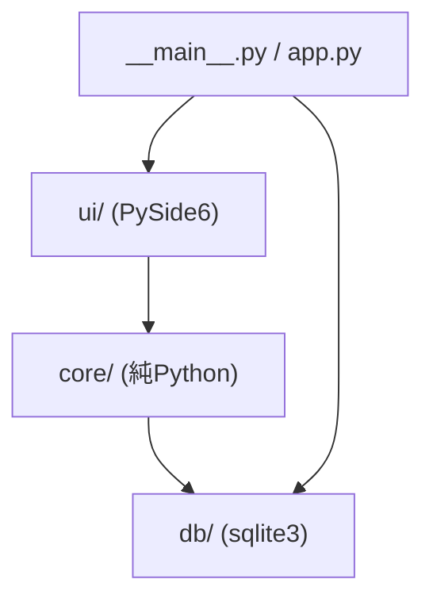
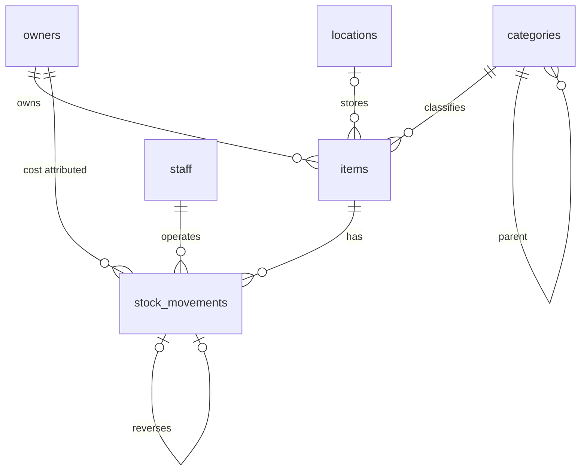
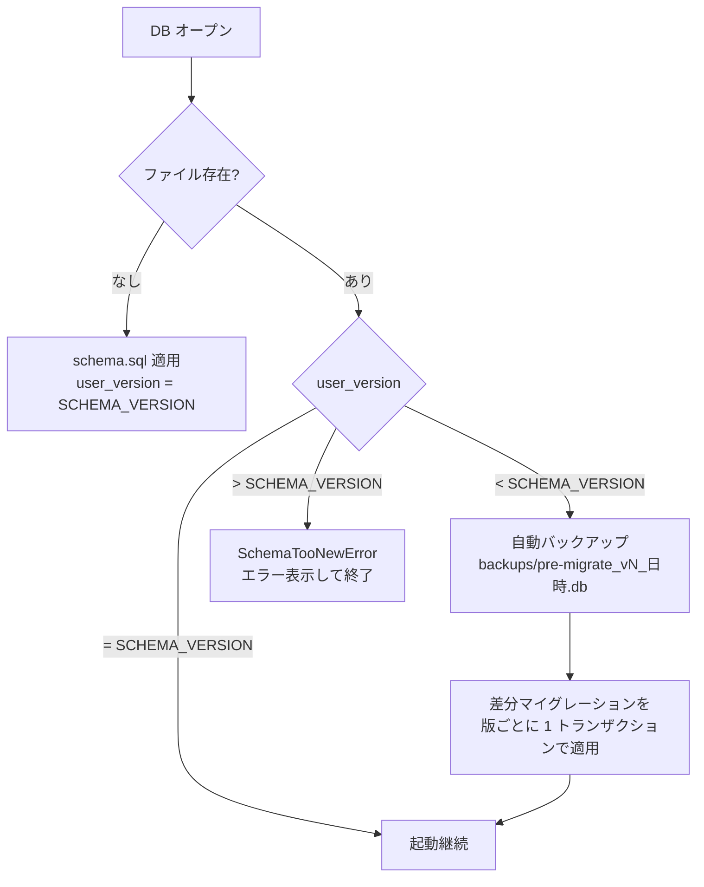
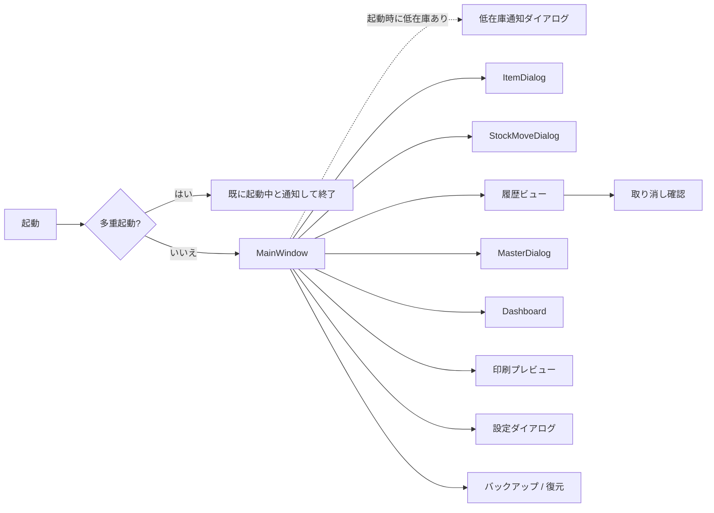
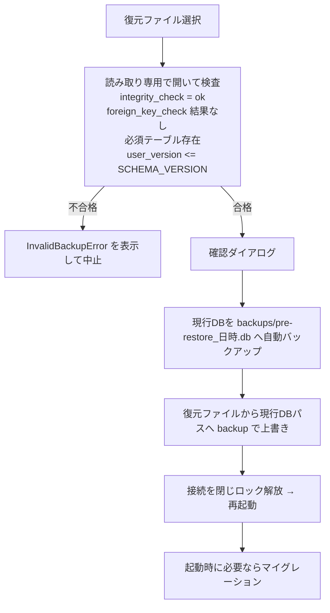

# 備品在庫管理アプリ 開発計画書(基本設計)

- 作成日: 2026-10-01
- ステータス: 案(レビュー待ち)
- 上位文書: [ローカル在庫管理アプリ企画書](ローカル在庫管理アプリ企画書.md)
- 位置付け: 企画書の要件を実装可能な粒度に落とし込んだ基本設計と開発計画。各フェーズの実装計画書はこの文書を基盤として作成する

---

## 1. 概要・スコープ

### 1.1 目的

企画書 1 章の目的(欠品による作業停止と発注漏れの防止)を、ローカルで完結する PySide6 デスクトップアプリとして実現する。

### 1.2 MVP スコープ

| 区分 | 対象 |
| --- | --- |
| 対象 | 品目マスタ管理、関連マスタ管理、在庫操作(入庫・出庫・返品・廃棄・棚卸・取り消し)、履歴閲覧、低在庫アラート、販売ページリンク、CSV エクスポート、ダッシュボード、印刷(棚ラベル・在庫表)、手動バックアップ・復元、多重起動防止、Windows インストーラー |
| 対象外 | 個体管理(シリアル・貸出返却)、CSV インポート、履歴の期間指定削除、バーコード/QR スキャナ対応、発注リスト出力、「発注済み」ステータス、多言語対応、単位換算 |

### 1.3 用語

| 用語 | 定義 |
| --- | --- |
| 所有者 | 在庫の法的帰属先。費用帰属の単位 |
| 担当者 | アプリの操作者。全在庫操作で選択する |
| 品目 | 在庫管理の単位。管理番号で一意に識別 |
| 廃止 | 品目の論理削除(`items.is_active = 0`)。再有効化可能 |
| 無効化 | 所有者・担当者の論理削除(`is_active = 0`)。新規選択肢から除外 |
| 在庫操作 | `stock_movements` に 1 行を追加し、`items.quantity` を更新する処理 |
| 取り消し | 元操作の `delta` を符号反転した行を追加する逆仕訳 |
| 有効な操作 | 取り消し行でも、取り消された行でもない操作 |
| 低在庫 | 有効品目で `quantity <= reorder_threshold` |

---

## 2. 開発環境・体制

### 2.1 ツールチェーン

| 項目 | 選択 |
| --- | --- |
| Python | 3.13(`requires-python = ">=3.13"`) |
| パッケージ管理 | uv(`pyproject.toml` + `uv.lock` をコミット) |
| ビルドバックエンド | hatchling(`src/` レイアウト) |
| 主要依存 | PySide6、platformdirs |
| 開発依存 | pytest、pytest-qt、pytest-cov、ruff、pyright、pyinstaller |
| リンタ/フォーマッタ | ruff(`ruff check` / `ruff format`) |
| 型検査 | pyright(`core/`・`db/` は strict、`ui/` は standard) |
| CI | GitHub Actions(`windows-latest` / `ubuntu-latest`) |

### 2.2 CI パイプライン

1. `uv sync --locked`
2. `uv run ruff check` / `uv run ruff format --check`
3. `uv run pyright`
4. `uv run pytest --cov`(Linux は `QT_QPA_PLATFORM=offscreen`、Qt 実行に必要な OS パッケージを導入)
5. (フェーズ 8 以降)タグ push 時に Windows で PyInstaller + Inno Setup を実行し成果物を保存

### 2.3 開発ルール

- ブランチ: `main` は常にテスト成功状態。作業は `feature/<フェーズ>-<内容>` で行い PR でマージ
- コミットメッセージ: Conventional Commits(`feat:` / `fix:` / `test:` / `docs:` など)
- バージョン: SemVer。アプリ版数は `pyproject.toml`、スキーマ版数は `db/migrations.py` の `SCHEMA_VERSION` で管理(両者は独立)

---

## 3. アーキテクチャ

### 3.1 層構成と依存方向



- 依存は `ui → core → db` の一方向。`core/` と `db/` は PySide6 を import しない(pyright・テストで担保)
- UI は Service のみを呼び出し、Repository や SQL を直接扱わない
- Service はトランザクション境界を持つ。1 つの業務操作 = 1 トランザクション

### 3.2 モジュール構成

| モジュール | 責務 |
| --- | --- |
| `__main__.py` | エントリポイント。`app.main()` を呼ぶ |
| `app.py` | 起動シーケンス(多重起動チェック → ログ初期化 → DB オープン・マイグレーション → MainWindow 表示 → 低在庫通知) |
| `config.py` | パス解決(platformdirs)、定数 |
| `core/models.py` | dataclass(`Item`、`StockMovement`、`Owner`、`Staff`、`Category`、`Location`、`ItemFilter`、`PurchaseInfo` 等) |
| `core/errors.py` | 業務例外 |
| `core/services.py` | `InventoryService`、`MasterService`、`SettingsService` |
| `core/reports.py` | `ReportService`(ダッシュボード集計、CSV 出力) |
| `db/connection.py` | 接続生成、PRAGMA 設定、`transaction()` コンテキストマネージャ |
| `db/schema.sql` | 最新 DDL |
| `db/migrations.py` | `SCHEMA_VERSION`、バージョン判定、マイグレーション適用 |
| `db/repositories.py` | `ItemRepository`、`MovementRepository`、`MasterRepository`、`SettingsRepository` |
| `db/backup.py` | バックアップ、復元前検査、復元 |
| `ui/single_instance.py` | 多重起動防止(`QLockFile`) |
| `ui/main_window.py` ほか | 画面(6 章) |

### 3.3 業務例外

すべて `core/errors.py` の `DomainError` を基底とし、UI は `DomainError` を捕捉してメッセージを表示する。それ以外の例外はログ出力の上で汎用エラーダイアログを表示する。

| 例外 | 発生条件 |
| --- | --- |
| `ValidationError` | 入力値不正(必須欠落、URL スキーム不正、接頭辞形式不正、数量 0 以下 等) |
| `NegativeStockError` | 操作・取り消しの結果、在庫が負になる |
| `InactiveItemError` | 廃止品目への在庫操作・取り消し |
| `InactiveMasterError` | 無効化済み所有者・担当者の新規選択 |
| `AlreadyReversedError` | 取り消し済みの操作の再取り消し |
| `ReversalNotAllowedError` | 取り消し行の取り消し、差分 0 の棚卸記録の取り消し |
| `CategoryCycleError` | カテゴリの親に自身または子孫を指定 |
| `PrefixLockedError` | 使用済み接頭辞の変更 |
| `MasterInUseError` | 使用中マスタの削除 |
| `SchemaTooNewError` | アプリより新しいスキーマの DB を開こうとした |
| `InvalidBackupError` | 復元対象ファイルの検査不合格 |

### 3.4 DB 接続・トランザクション

- `sqlite3.connect(path, autocommit=True)` で接続し、トランザクションは明示制御する
- 接続直後に `PRAGMA foreign_keys = ON; PRAGMA journal_mode = WAL; PRAGMA busy_timeout = 5000;`
- `transaction(conn)` は `BEGIN IMMEDIATE` → 正常終了で `COMMIT`、例外で `ROLLBACK`
- `sqlite3.IntegrityError`(CHECK・UNIQUE 違反)は Repository で対応する業務例外に変換する。業務ルールは Service で事前検査し、DB 制約は最終防衛線とする
- 日時は `'YYYY-MM-DD HH:MM:SS'` 形式のローカル時刻文字列で保存する

### 3.5 ファイル配置

| 種別 | 場所 |
| --- | --- |
| DB | `user_data_dir("inventory-app", appauthor=False, roaming=True)/inventory.db`(Windows: `%APPDATA%\inventory-app\`) |
| バックアップ既定保存先 | 同上 `/backups/`(保存時に変更可) |
| ロックファイル | 同上 `/inventory.lock` |
| ログ | `user_log_dir(...)/app.log`(`RotatingFileHandler`、1 MB × 5 世代) |

---

## 4. DB 基本設計

### 4.1 ER 図



### 4.2 スキーマ

企画書 4.3 の DDL を基本とし、以下を追加する。

```sql
CREATE TABLE settings (
  key TEXT PRIMARY KEY,
  value TEXT NOT NULL
);
INSERT INTO settings (key, value) VALUES ('fiscal_year_start_month', '4');
```

| キー | 型(値の解釈) | 既定 | 用途 |
| --- | --- | --- | --- |
| `fiscal_year_start_month` | 整数 1〜12 | `4` | ダッシュボードの年度区切り |

設定値の型変換・範囲検証は `SettingsService` で行う。

### 4.3 カラム運用ルール

| テーブル.カラム | ルール |
| --- | --- |
| `items.quantity` | 在庫操作(Service)経由でのみ更新。品目編集では変更不可 |
| `items.code` | 登録時に採番し以後不変 |
| `stock_movements.owner_id` | 通常操作: 操作時点の `items.owner_id`。取り消し行: 元行の `owner_id` |
| `stock_movements.unit_price` | 入庫: 入力された実単価(既定は参考価格)。出庫・返品・廃棄・棚卸: 操作時点の `items.reference_price`。取り消し行: 元行の `unit_price` |
| `stock_movements.moved_at` | 常に記録時刻(遡り入力不可) |
| `stock_movements.used_for` | 出庫時必須。取り消し行は元行をコピー |
| `categories.next_seq` | 採番時に読み出し・インクリメント。`next_seq > 1` で接頭辞変更不可 |

### 4.4 マイグレーション



- 初版は `SCHEMA_VERSION = 1`
- マイグレーションは `migrations.py` に `{版数: SQL}` として手書きで追加する。各版の適用と `PRAGMA user_version` 更新を同一トランザクションで行う
- スキーマ変更は前方互換(列追加・テーブル追加中心)を原則とする
- マイグレーション失敗時はロールバックし、バックアップの場所を示してエラー終了する

---

## 5. 業務ルール

### 5.1 品目

| 操作 | ルール |
| --- | --- |
| 登録 | 所有者(有効)・品名・カテゴリ必須。初期数量(既定 0)・閾値(既定 0)入力可。管理番号採番と品目 INSERT を同一トランザクションで行う。初期数量が 1 以上なら `reason='adjust'` の履歴を同時に記録する |
| 採番 | `UPDATE categories SET next_seq = next_seq + 1 WHERE id = ? RETURNING next_seq - 1` で連番を確保し、`code_prefix || '-' || printf('%04d', seq)` を生成。10000 以降は 5 桁となる |
| 編集 | 管理番号・現在数量以外を編集可。所有者変更は有効な所有者のみ。過去履歴の `owner_id` は変更しない |
| 販売ページ URL | 空欄可。入力時は `urllib.parse` で解析し、スキーム `http`/`https` かつホスト名ありのみ許可 |
| 廃止 | 在庫残の有無に関わらず可能。確認ダイアログを表示 |
| 再有効化 | いつでも可能 |
| 廃止品目 | アラート対象外、一覧既定非表示、在庫操作・取り消し不可、編集は可 |

### 5.2 在庫操作

| 操作 | reason | delta | 必須入力 | unit_price |
| --- | --- | --- | --- | --- |
| 入庫 | `in` | +数量 | 担当者、数量 | 参考価格を既定値として実単価を上書き入力可 |
| 出庫 | `out` | −数量 | 担当者、数量、使用先 | 操作時点の参考価格 |
| 返品 | `return` | −数量 | 担当者、数量 | 操作時点の参考価格 |
| 廃棄 | `dispose` | −数量 | 担当者、数量 | 操作時点の参考価格 |
| 棚卸 | `adjust` | 実数 − 現在数 | 担当者、実数 | 操作時点の参考価格 |

- 数量は 1 以上の整数。棚卸の実数は 0 以上の整数で、差分 0 でも記録する
- 入庫時に実単価が参考価格と異なる場合、「参考価格を更新しますか」と確認し、了承時は同一トランザクションで `items.reference_price` を更新する
- 減少操作で `quantity + delta < 0` となる場合は `NegativeStockError`
- 処理順: 検証 → `stock_movements` INSERT → `items.quantity` UPDATE(同一トランザクション)
- 担当者・所有者は有効なもののみ選択可(過去履歴の表示には無効化済みも表示)

### 5.3 取り消し

- 新規行: `reason`・`owner_id`・`unit_price`・`used_for` は元行をコピー、`delta = −元delta`、`reversal_of = 元行id`、`staff_id` は取り消し操作者、`moved_at` は記録時刻、`note` は任意入力
- 取り消し不可条件:
  - 元行が取り消し行(`reversal_of IS NOT NULL`) → `ReversalNotAllowedError`
  - 元行が取り消し済み(`reversal_of` の UNIQUE 制約でも担保) → `AlreadyReversedError`
  - 元行が `adjust` かつ `delta = 0` → `ReversalNotAllowedError`
  - 品目が廃止 → `InactiveItemError`(再有効化後に取り消す)
  - 取り消し後の在庫が負 → `NegativeStockError`
- 初期数量の `adjust` も上記条件を満たせば取り消し可能

### 5.4 マスタ管理

| マスタ | 使用中の判定 | 未使用時 | 使用中 |
| --- | --- | --- | --- |
| 所有者 | `items` または `stock_movements` から参照 | 物理削除可 | 無効化のみ可(再有効化可) |
| 担当者 | `stock_movements` から参照 | 物理削除可 | 無効化のみ可(再有効化可) |
| カテゴリ | `items` から参照、または子カテゴリあり | 物理削除可 | 削除不可 |
| 保管場所 | `items` から参照 | 物理削除可 | 削除不可 |

- カテゴリの親変更時、新しい親が自身または子孫であれば `CategoryCycleError`(再帰 CTE で子孫を取得して判定)
- カテゴリ名は同一親の下で一意(式インデックス)
- 接頭辞は英大文字・数字 2〜5 文字、全カテゴリで一意。`next_seq > 1`(採番実績あり)の場合は変更不可
- 名称の変更はすべてのマスタで可能

### 5.5 低在庫判定

```sql
SELECT ... FROM items WHERE is_active = 1 AND quantity <= reorder_threshold;
```

- 在庫操作・取り消し・品目編集(閾値変更)・廃止/再有効化の後に再判定し、テーブル着色・アラートパネル・バッジを更新する
- 再判定は Service 完了後に UI 側の `DataChanged` 通知(Qt シグナル)で一括実行する

### 5.6 最終購入日・購入ロット数

取り消されていない直近の入庫行から求める。

```sql
SELECT m.moved_at, m.delta
FROM stock_movements m
WHERE m.item_id = :item_id
  AND m.reason = 'in'
  AND m.reversal_of IS NULL
  AND NOT EXISTS (SELECT 1 FROM stock_movements r WHERE r.reversal_of = m.id)
ORDER BY m.moved_at DESC, m.id DESC
LIMIT 1;
```

### 5.7 ダッシュボード集計

- 集計キー: `stock_movements.owner_id`(操作時点の所有者)
- 期間判定日: 取り消し行は元行の `moved_at`、それ以外は自身の `moved_at`(`COALESCE(o.moved_at, m.moved_at)`、`o` は `reversal_of` で結合した元行)。取り消しが月や年度をまたいでも元の期間で相殺される
- 年度: 開始月 `s` に対し `年度 = 年 − (月 < s ? 1 : 0)`。月次は年度内の 12 か月を表示

| 指標 | 式 |
| --- | --- |
| 入庫数 | `SUM(delta) WHERE reason = 'in'` |
| 出庫数 | `SUM(-delta) WHERE reason = 'out'` |
| 支出額 | `SUM(-delta * unit_price) WHERE reason = 'out' AND unit_price IS NOT NULL` |
| 単価未登録の出庫件数 | 有効な操作のうち `reason = 'out' AND unit_price IS NULL` の件数 |
| 廃棄数 | `SUM(-delta) WHERE reason = 'dispose'` |
| 廃棄額 | `SUM(-delta * unit_price) WHERE reason = 'dispose' AND unit_price IS NOT NULL` |

返品・棚卸調整(初期数量を含む)は上記いずれにも含めない。

### 5.8 CSV エクスポート

- 文字コード UTF-8(BOM 付き)、改行 CRLF、`csv` モジュールで全項目を適切にクォート
- 数式インジェクション対策として、`=` `+` `-` `@` タブ・CR で始まる文字列セルは先頭に `'` を付与する(数値列は対象外)

| 種類 | 列 |
| --- | --- |
| 在庫一覧 | 管理番号、品名、所有者、カテゴリ(フルパス)、保管場所、数量、単位、閾値、推奨発注数、低在庫、参考価格、仕入先、販売ページURL、最終購入日、購入ロット数、状態(有効/廃止)、備考 |
| 履歴 | 日時、管理番号、品名、操作種別、数量(符号付き)、単価、所有者、担当者、使用先、取り消し元ID、取り消し済み、メモ |
| ダッシュボード | 年度/月、所有者、入庫数、出庫数、支出額、単価未登録件数、廃棄数、廃棄額 |

ダッシュボードのグラフは表示中のチャートを PNG で保存する(`QChartView.grab()`)。

### 5.9 設定

- `fiscal_year_start_month`: 設定ダイアログで 1〜12 を選択。変更後ダッシュボードを再集計

---

## 6. 画面設計

### 6.1 画面遷移



### 6.2 メニュー・ツールバー

| メニュー | 項目 |
| --- | --- |
| ファイル | CSV 出力(在庫一覧 / 履歴)、印刷(棚ラベル / 在庫表)、バックアップ、復元、終了 |
| 品目 | 新規、編集、廃止 / 再有効化、販売ページを開く、履歴 |
| 在庫 | 入庫、出庫、返品、廃棄、棚卸 |
| マスタ | 所有者、担当者、カテゴリ、保管場所 |
| 表示 | アラートパネル表示切替、ダッシュボード、廃止品目を含む |
| ツール | 設定 |
| ヘルプ | バージョン情報(アプリ版・スキーマ版・DB パス) |

ツールバー: 新規 / 入庫 / 出庫 / 返品・廃棄 / 棚卸 / CSV 出力 / 印刷

### 6.3 画面詳細

| 画面 | 主な構成要素 | 入力・活性制御 |
| --- | --- | --- |
| MainWindow | 検索欄(品名・管理番号の部分一致)、絞り込み(所有者・カテゴリ(子孫含む)・保管場所・低在庫のみ・廃止品目を含む)、`QTableView` + `QSortFilterProxyModel`、低在庫ドック | 低在庫行を着色、廃止行はグレー表示。在庫操作ボタンは有効品目選択時のみ活性。ダブルクリックで履歴ビュー |
| 低在庫ドック | 低在庫一覧(管理番号・品名・数量・閾値・推奨発注数・販売ページボタン)、タイトルに件数バッジ | 行ダブルクリックでメイン一覧の該当行を選択 |
| 起動時通知 | 低在庫一覧と「閉じる」 | 低在庫 0 件なら表示しない |
| ItemDialog | 管理番号(表示のみ)、所有者、品名、カテゴリ(ツリー選択)、保管場所、単位、初期数量(新規時のみ)/現在数量(編集時は表示のみ)、閾値、推奨発注数、販売ページ URL(開くボタン)、仕入先、参考価格、備考、最終購入日・購入ロット数(表示のみ) | 必須未入力・URL 不正で OK 不活性とエラー表示 |
| StockMoveDialog | 品目選択(検索付き)、操作種別、数量または実数、担当者、使用先、単価(入庫時のみ)、メモ、操作後数量プレビュー | 出庫時は使用先必須。操作後数量が負なら OK 不活性。棚卸は差分を表示 |
| 履歴ビュー | 品目の履歴一覧(日時・種別・数量・単価・所有者・担当者・使用先・メモ・取り消し状態) | 取り消し不可条件に該当する行では「取り消し」を不活性化し、理由をツールチップ表示 |
| MasterDialog | タブ: 所有者 / 担当者 / カテゴリ(ツリー、接頭辞、次番号表示) / 保管場所 | 削除・無効化ボタンは 5.4 に従い活性制御 |
| Dashboard | 所有者選択(全体/個別)、年度選択、年次/月次切替、棒グラフ(入庫数・出庫数・支出額)、廃棄の別表、単価未登録件数、CSV/PNG 出力 | — |
| 印刷プレビュー | `QPrintPreviewDialog`。棚ラベルは品目複数選択から生成、在庫表は現在の絞り込み結果を出力 | — |
| 設定ダイアログ | 年度開始月 | — |

### 6.4 表示要件

- 最小解像度 1366×768 で全ダイアログが画面内に収まること(必要に応じ `QScrollArea`)
- 数値は右寄せ、金額は 3 桁区切り + 「円」
- 日本語のみ。UI 文字列は各画面モジュールに直書きする(多言語化しない)

---

## 7. 非機能設計

### 7.1 多重起動防止

- `QLockFile` をデータディレクトリの `inventory.lock` に作成し、`setStaleLockTime(0)`(プロセス存続中は stale 判定しない)で `tryLock(100)` する
- 取得失敗時は「既に起動しています」とメッセージ表示して終了する。異常終了で残ったロックは、`QLockFile` が PID の生存確認により自動回収する
- ロックはアプリ終了まで保持する。復元後の再起動時は、ロックを解放してから新プロセスを起動する
- DB を開く前にロックを取得する(マイグレーション・復元との競合防止)

### 7.2 バックアップ・復元

バックアップ:

- `sqlite3.Connection.backup()` で `inventory_YYYYMMDD_HHMMSS.db` を作成(保存先はダイアログで指定、既定は `backups/`)

復元:



- 再起動: PyInstaller 版は `sys.executable`、Python 環境では `sys.executable -m inventory_app` を `QProcess.startDetached` で起動してから終了する

### 7.3 ログ

- `logging` を使用し、INFO 以上をファイル出力。未捕捉例外は `sys.excepthook` で記録してダイアログ表示
- 在庫操作の内容は DB 履歴が正であるため、ログは障害調査用途に限定する

### 7.4 セキュリティ

- SQL はすべてプレースホルダでパラメータ化する
- 販売ページ URL は `http`/`https` のみ許可し、`QDesktopServices.openUrl` に渡す前に再検証する
- CSV の数式インジェクション対策(5.8)
- ネットワーク通信はブラウザ起動以外に行わない

### 7.5 性能目標

| 項目 | 目標(品目 5,000 件・履歴 100,000 件) |
| --- | --- |
| 起動から一覧表示 | 3 秒以内 |
| 検索・絞り込み | 体感遅延なし(0.3 秒以内) |
| 在庫操作の保存と再描画 | 0.5 秒以内 |
| ダッシュボード集計 | 2 秒以内 |

フェーズ 1 で性能テスト用のダミーデータ生成スクリプトを用意し、フェーズ 2・6 で計測する。

---

## 8. テスト方針

| 対象 | 方法 | 主な観点 |
| --- | --- | --- |
| `db/` | pytest + `:memory:` DB | DDL 制約(CHECK・UNIQUE・FK)、マイグレーション(新規作成・旧版更新・新版拒否)、採番の連番と非再利用、バックアップ・復元前検査 |
| `core/` | pytest + `:memory:` DB | 5 章の全ルール。特に負の在庫禁止、取り消し不可条件、初期数量の adjust 記録、所有者変更後の費用帰属、年度区切り、月またぎ取り消しの相殺、最終購入日の算出、CSV エスケープ |
| `ui/` | pytest-qt | 主要画面の起動スモーク、ダイアログの活性制御、低在庫着色・バッジ更新、多重起動防止 |
| 印刷 | 手動チェックリスト | ラベル位置ずれ、文字の切り捨て、改ページ |
| 配布 | 手動チェックリスト | クリーン環境へのインストール、起動、QtCharts・印刷動作、アンインストール時にデータが残ること |

- カバレッジ目標: `core/`・`db/` で行カバレッジ 90% 以上
- Service テストは共通フィクスチャ(マスタ投入済み DB)を `tests/conftest.py` に用意する

---

## 9. フェーズ計画

| # | 内容 | 主な成果物 | 完了条件 |
| --- | --- | --- | --- |
| 0 | 開発基盤 | `pyproject.toml`、`uv.lock`、ruff/pyright 設定、CI、空パッケージ | CI が Windows/Linux で成功 |
| 1 | スキーマ・リポジトリ・サービス層 | `db/*`、`core/*`(UI 以外の全業務ロジック、CSV・集計含む)、テスト、ダミーデータ生成スクリプト | 8 章 `db/`・`core/` 観点のテストが成功しカバレッジ目標達成 |
| 2 | MainWindow・品目 CRUD・マスタ管理・多重起動防止 | `app.py`、`main_window.py`、`item_table_model.py`、`ItemDialog`、`MasterDialog`、`single_instance.py` | 品目とマスタの登録・編集・廃止・削除が UI から可能。性能目標(一覧・絞り込み)達成 |
| 3 | 在庫操作・履歴・取り消し | `StockMoveDialog`、履歴ビュー | 全操作種別と取り消しが UI から可能。不可条件で操作不可 |
| 4 | 低在庫アラート | 行着色、アラートドック、起動時通知 | 在庫変動・閾値変更・廃止に即時追従 |
| 5 | 販売ページ・CSV・バックアップ/復元 | URL を開く導線、CSV 出力、バックアップ・復元、設定ダイアログ | 復元フロー(7.2)が動作し、不正ファイルを拒否 |
| 6 | ダッシュボード | `dashboard.py` | 5.7 の集計がテストデータと一致。CSV/PNG 出力可能 |
| 7 | 印刷 | `printing/`(棚ラベル・在庫表) | 実用紙への試し刷りで位置ずれ許容範囲内 |
| 8 | パッケージング | PyInstaller spec、Inno Setup スクリプト、リリースワークフロー | 8 章の配布チェックリスト合格 |

依存関係: 0 → 1 → 2 → 3 → 4 → 5 → 8 の順に進める。6・7 はフェーズ 3 完了後、5 と並行して進められる。

### 9.1 印刷の基本設計(フェーズ 7 の前提)

- 棚ラベル: `エーワン 31665 A4 12面`(暫定)。寸法(上・左余白、ラベル幅・高さ、縦横ピッチ)は `LabelSpec` dataclass に集約し、用紙確定後に実測値を設定する
- 印字項目: 品名・管理番号・保管場所・備考。各項目は `QFontMetrics.elidedText` で描画幅を基準に切り捨て
- `QPrinter` の解像度に依存しないよう mm 単位で座標計算し、`QPageLayout` の余白は 0 にして紙端基準で描画する
- 在庫表: A4 横、列は在庫一覧 CSV の主要列。改ページ時はヘッダ行を繰り返し、フッタに印刷日時・ページ番号

### 9.2 パッケージングの基本設計(フェーズ 8 の前提)

- PyInstaller `--onedir --windowed`。QtCharts と印刷サポートのプラグインが同梱されていることを確認する
- Inno Setup: `{autopf}` へインストール、スタートメニュー登録、アンインストール時にユーザーデータ(`%APPDATA%\inventory-app`)は削除しない
- Linux: `uv sync` と `uv run python -m inventory_app` による起動手順を README に記載

---

## 10. リスクと対策

| リスク | 影響 | 対策 |
| --- | --- | --- |
| PyInstaller で Qt プラグイン(QtCharts・印刷)が欠落 | 配布版で機能不全 | フェーズ 2 時点で最小構成の試験ビルドを作り、早期に確認 |
| ラベル用紙の寸法誤差・プリンタ差 | 印字ずれ | `LabelSpec` の値で調整できるようにし、実機で試し刷りする |
| Windows/Linux 間のフォント・印刷差異 | レイアウト崩れ | 既定フォントを OS 別に指定し、両 OS で目視確認 |
| `%APPDATA%`(移動プロファイル)上の DB | ドメイン環境で同期遅延・破損 | 単一 PC 運用前提。問題があれば保存先を `%LOCALAPPDATA%` に変更できるよう `config.py` に集約 |
| 復元・マイグレーション中の異常終了 | DB 破損 | 処理前の自動バックアップと、版ごとのトランザクション適用 |
| PySide6 と Python 3.13 の組み合わせ不具合 | 開発停止 | `uv.lock` で版を固定し、CI で検知 |

---

## 11. 企画書からの差分

本計画書で企画書から追加・変更・具体化した事項。企画書は変更せず、本表で管理する。

| # | 区分 | 企画書の記載 | 本計画書での扱い | 該当節 |
| --- | --- | --- | --- | --- |
| 1 | 追加 | なし | `settings` テーブルを追加し、アプリ設定を DB 内に保存(バックアップ・移行で設定も引き継がれる) | 4.2 |
| 2 | 追加 | 「年間」の区切り未定義 | 年度開始月を設定で切り替え可能(既定 4 月) | 5.7、5.9 |
| 3 | 変更 | `unit_price` は記録時点の参考価格 | 入庫時のみ実単価を入力可(既定は参考価格)。参考価格を更新するか確認する。その他の操作は企画書どおり | 4.3、5.2 |
| 4 | 具体化 | 現在数量は品目属性 | 数量は在庫操作経由でのみ変更。登録時の初期数量は `adjust` 履歴として記録し、入庫集計に含めない | 5.1 |
| 5 | 具体化 | 取り消しは符号反転行を追加 | 取り消し行は元行の `owner_id`・`unit_price`・`used_for` をコピー。集計上は元行の日付に帰属させ、期間をまたいでも相殺される | 5.3、5.7 |
| 6 | 追加 | 取り消し不可条件 3 つ | 差分 0 の棚卸記録と廃止品目の操作も取り消し不可(廃止品目は再有効化後に取り消す) | 5.3 |
| 7 | 追加 | なし | 操作日時の遡り入力は不可(記録時刻固定) | 4.3、5.2 |
| 8 | 追加 | マスタ削除の扱い未定義 | 未使用なら物理削除。使用中は所有者・担当者のみ無効化可、カテゴリ・保管場所は削除不可 | 5.4 |
| 9 | 具体化 | 接頭辞は「使用後は変更不可」 | 「使用後」を `next_seq > 1`(採番実績あり)と定義 | 5.4 |
| 10 | 具体化 | 6.9 のマイグレーション方針が曖昧 | 古い DB は自動バックアップ後に自動マイグレーション、新しい DB は開かずエラー終了 | 4.4 |
| 11 | 具体化 | バックアップ・復元(手動) | 復元手順を「現行 DB 自動バックアップ → 検査 → 置換 → 再起動」と定義 | 7.2 |
| 12 | 追加 | なし | 多重起動防止(`QLockFile`) | 7.1 |
| 13 | 具体化 | CSV エクスポート、ダッシュボードのエクスポート | CSV は UTF-8 BOM 付き・数式インジェクション対策あり。ダッシュボードは CSV + PNG | 5.8 |
| 14 | 具体化 | Python 3.x | Python 3.13、uv、ruff、pyright、pytest-qt、GitHub Actions(Windows/Linux) | 2 章 |
| 15 | 追加 | なし | 業務例外の体系、性能目標、ログ方針 | 3.3、7.3、7.5 |
| 16 | 追加 | 実装フェーズ 1〜8 | フェーズ 0(開発基盤)を追加し、各フェーズに完了条件を設定 | 9 章 |

---

## 12. 未決事項

| # | 項目 | 期限 |
| --- | --- | --- |
| 1 | 棚ラベル用紙の最終確定と実寸測定(`LabelSpec` の値) | フェーズ 7 着手前 |
| 2 | 使いかけのラベル用紙への対応(印字開始位置の指定) | フェーズ 7 着手前 |
| 3 | インストーラー表示名・発行元・アイコン・ライセンス表記 | フェーズ 8 着手前 |
| 4 | 正式なアプリ名(`platformdirs` のディレクトリ名に影響するため、初回リリース後は変更不可) | フェーズ 2 着手前 |
